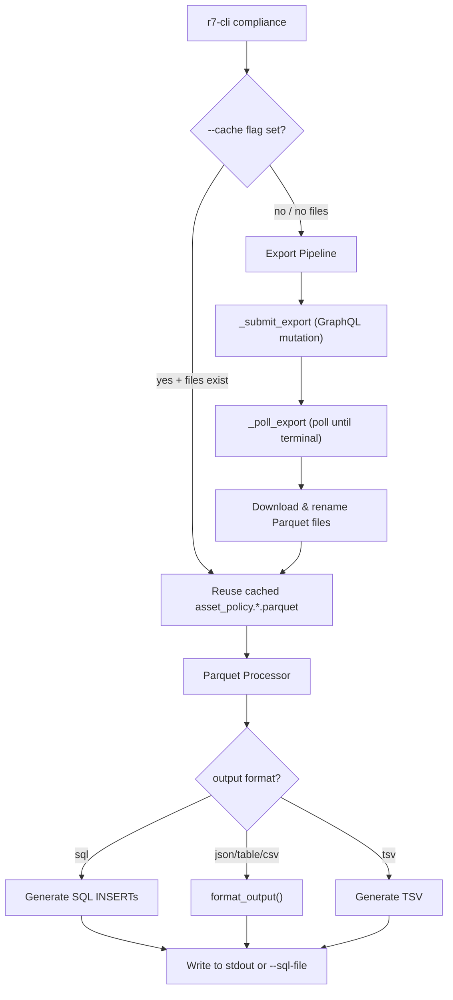

# Design Document: compliance-command

## Overview

The `compliance` command is a new top-level CLI command registered on the `SolutionGroup` multi-command in `main.py`. It orchestrates a three-phase pipeline:

1. **Export** — Trigger a VM policy export via the existing GraphQL mutation (`createPolicyExport`), poll for completion, and download the resulting Parquet files.
2. **Read** — Load the downloaded `asset_policy` Parquet files using `pyarrow` and extract rows according to the `Policy_Schema`.
3. **Format** — Convert the extracted rows into the requested output format (SQL INSERT statements by default, or json/table/csv/tsv).

The command reuses the existing `_submit_export`, `_poll_export`, and `_download_parquet_urls` helper functions from `solutions/vm.py` but wraps them with compliance-specific file naming, caching, and post-processing logic.

The default output format for `compliance` is `sql`, unlike other commands which default to `json`. A new `tsv` format is introduced specifically for this command.

## Architecture



### Key Design Decisions

1. **Reuse vm.py helpers directly** — The export pipeline functions (`_submit_export`, `_poll_export`, `_download_parquet_urls`) are imported from `solutions/vm.py` rather than duplicated. This keeps the export logic in one place.

2. **New module `compliance.py`** at the package root — The compliance command lives in `compliance.py` (alongside `main.py`, `output.py`, etc.) rather than under `solutions/` because it is a top-level command, not a solution subcommand.

3. **pyarrow for Parquet reading** — `pyarrow` is the standard Python library for reading Parquet files. It will be added as a required dependency in `pyproject.toml`.

4. **Custom file naming** — Downloaded files are renamed to `{prefix}.{timestamp}.parquet` (with optional index suffix for multi-URL entries) instead of keeping the raw S3 filenames. This makes cache matching via glob straightforward.

5. **SQL as default format** — The compliance command overrides the global `--output` default from `json` to `sql` by checking the resolved config and substituting when the user hasn't explicitly set a format.

## Components and Interfaces

### 1. `compliance.py` — Command Module (new file)

```python
# Top-level Click command
@click.command("compliance")
@click.option("--output-dir", type=click.Path(), default=".", help="Directory for Parquet files.")
@click.option("--table-name", default="policy_compliance", help="SQL target table name.")
@click.option("--sql-file", type=click.Path(), default=None, help="Write output to file instead of stdout.")
@click.option("--poll-interval", type=int, default=10, help="Export poll interval in seconds.")
@click.pass_context
def compliance(ctx, output_dir, table_name, sql_file, poll_interval): ...
```

Internal functions:
- `_find_cached_files(output_dir: str) -> list[Path]` — Glob for `asset_policy.*.parquet` in the output directory.
- `_download_and_rename(client, export, output_dir) -> list[Path]` — Download Parquet files from the export result, renaming them to `{prefix}.{timestamp}.parquet` format. Uses the export's `timestamp` field for the timestamp component, formatted as short ISO 8601 (e.g. `2026-04-07T10:00Z`). Appends a zero-based index when a result entry has multiple URLs.
- `_read_policy_parquet(paths: list[Path]) -> list[dict]` — Read `asset_policy` prefixed Parquet files using `pyarrow`, returning a list of row dicts.
- `_format_sql(rows: list[dict], table_name: str, timestamp: str) -> str` — Convert rows to SQL INSERT statements with a header comment.
- `_format_tsv(rows: list[dict]) -> str` — Convert rows to tab-separated values with a header row.

### 2. `main.py` — Registration

Add `compliance` to `SolutionGroup.list_commands()` and `get_command()`:

```python
def list_commands(self, ctx):
    return sorted(VALID_SOLUTIONS | {"validate", "compliance"})

def get_command(self, ctx, name):
    ...
    if name == "compliance":
        from r7cli.compliance import compliance
        return compliance
    ...
```

### 3. `output.py` — TSV Format (extension)

Add `_format_tsv(data)` to `output.py` and update `format_output()` to handle `fmt="tsv"`. This keeps all formatting logic centralized.

```python
def _format_tsv(data: Any) -> str:
    """Render *data* as tab-separated values with a header row."""
    rows = _extract_rows(data)
    if not rows:
        return ""
    if isinstance(rows[0], dict):
        headers = list(rows[0].keys())
        lines = ["\t".join(headers)]
        for row in rows:
            lines.append("\t".join(str(row.get(h, "")) for h in headers))
        return "\n".join(lines)
    return "\n".join("\t".join(str(c) for c in row) for row in rows)
```

### 4. `models.py` — Constants Update

Add `"tsv"` and `"sql"` to `VALID_OUTPUT_FORMATS`.

### 5. `pyproject.toml` — Dependency

Add `pyarrow>=14.0` to the `dependencies` list.

## Data Models

### Policy Row (in-memory dict)

Each row read from a Parquet file is represented as a Python dict with keys matching the Policy_Schema columns:

```python
{
    "benchmarkNaturalId": str,
    "profileNaturalId": str,
    "benchmarkVersion": str,
    "ruleNaturalId": str,
    "orgId": str,
    "assetId": str,
    "finalStatus": str,
    "proof": str,
    "lastAssessmentTimestamp": str,  # ISO-8601 formatted
    "benchmarkTitle": str,
    "profileTitle": str,
    "publisher": str,
    "ruleTitle": str,
    "fixTexts": list[str],          # varchar[]
    "rationales": list[str],        # varchar[]
}
```

### SQL INSERT Statement Format

```sql
-- Compliance export: 2026-04-07T10:00Z | Rows: 1234
INSERT INTO policy_compliance (benchmarkNaturalId, profileNaturalId, benchmarkVersion, ruleNaturalId, orgId, assetId, finalStatus, proof, lastAssessmentTimestamp, benchmarkTitle, profileTitle, publisher, ruleTitle, fixTexts, rationales) VALUES ('CIS_...', 'L1', '1.0', 'rule_1', 'org1', 'asset1', 'PASS', 'proof text', '2026-04-07T10:00:00Z', 'CIS Benchmark', 'Level 1', 'CIS', 'Rule Title', ARRAY['fix1','fix2'], ARRAY['rat1']);
```

### File Naming Convention

| Scenario | Filename |
|---|---|
| Single URL per prefix | `asset_policy.2026-04-07T10:00Z.parquet` |
| Multiple URLs, first | `asset_policy.2026-04-07T10:00Z.0.parquet` |
| Multiple URLs, second | `asset_policy.2026-04-07T10:00Z.1.parquet` |
| Other prefix (e.g. asset) | `asset.2026-04-07T10:00Z.parquet` |

### Cache Glob Pattern

`asset_policy.*.parquet` — matches any previously downloaded policy files in the output directory.


## Correctness Properties

*A property is a characteristic or behavior that should hold true across all valid executions of a system — essentially, a formal statement about what the system should do. Properties serve as the bridge between human-readable specifications and machine-verifiable correctness guarantees.*

### Property 1: SQL Serialization Round-Trip

*For any* valid policy row dict (containing varchar strings, a timestamp, NULL values, and varchar arrays with arbitrary content including single quotes and special characters), serializing the row to a SQL INSERT statement and then parsing that INSERT statement back SHALL produce column names and values equivalent to the original row.

**Validates: Requirements 4.4, 4.5, 4.6, 4.7, 4.8, 4.9, 7.1, 7.2, 7.3**

### Property 2: One INSERT Per Row

*For any* non-empty list of policy row dicts, the number of SQL INSERT statements generated by `_format_sql` SHALL equal the number of input rows.

**Validates: Requirements 4.2**

### Property 3: File Naming Pattern

*For any* prefix string (non-empty, no path separators) and ISO-8601 timestamp string, and for any URL count (1 or more), the generated filenames SHALL match the pattern `{prefix}.{timestamp}.parquet` for single-URL entries, or `{prefix}.{timestamp}.{index}.parquet` for multi-URL entries where index is zero-based.

**Validates: Requirements 2.7, 2.8**

### Property 4: Asset Policy File Filtering

*For any* list of Path objects with mixed prefixes (e.g. `asset.*.parquet`, `asset_policy.*.parquet`, `other.*.parquet`), `_read_policy_parquet` SHALL only read files whose name starts with `asset_policy`.

**Validates: Requirements 4.1**

### Property 5: TSV Structure

*For any* non-empty list of policy row dicts, the TSV output SHALL have exactly `len(rows) + 1` lines (one header + one per row), the header line SHALL contain all column names separated by tabs, and each data line SHALL have the same number of tab-separated fields as the header.

**Validates: Requirements 5.6**

### Property 6: SQL Header Comment

*For any* timestamp string and positive row count, the SQL output SHALL begin with a comment line containing both the timestamp and the row count.

**Validates: Requirements 5.9**

## Error Handling

| Condition | Source | Message | Exit Code |
|---|---|---|---|
| Missing/invalid API key | `R7Client` (existing) | "No API key provided…" or "The provided key is not authorized…" | 2 |
| Export job FAILED | `_poll_export` result check | "Export {job_id} FAILED." | 2 |
| Corrupt/unreadable Parquet file | `pyarrow.parquet.read_table` exception | "Failed to read Parquet file '{path}': {error}" | 2 |
| Network error (connection, timeout, DNS) | `R7Client` → `NetworkError` | Propagated from httpx | 3 |
| `--sql-file` path not writable | `open()` / `OSError` | "Cannot write to '{path}': {error}" | 1 |
| FAILED_PRECONDITION on export | `_submit_export` (existing) | "Export already in progress: {job_id}" (continues polling) | — |

Error handling follows the existing pattern in the codebase:
- Catch `R7Error` subclasses at the command level
- Print to stderr via `click.echo(..., err=True)`
- Exit with the appropriate code from the exception hierarchy
- Parquet read errors are caught as a new try/except around `pyarrow.parquet.read_table`, wrapped in a click error with exit code 2

## Testing Strategy

### Property-Based Tests (using Hypothesis)

Hypothesis is already listed in `[project.optional-dependencies] dev` in `pyproject.toml`. Each property test runs a minimum of 100 iterations.

| Property | Test Description | Tag |
|---|---|---|
| Property 1 | Generate random policy rows (with special chars, NULLs, arrays, timestamps), serialize to SQL, parse back, assert equivalence | `Feature: compliance-command, Property 1: SQL round-trip` |
| Property 2 | Generate random-length lists of policy rows, serialize, count INSERT lines | `Feature: compliance-command, Property 2: One INSERT per row` |
| Property 3 | Generate random prefixes and timestamps with varying URL counts, verify filename pattern | `Feature: compliance-command, Property 3: File naming pattern` |
| Property 4 | Generate random lists of filenames with mixed prefixes, verify only asset_policy files are selected | `Feature: compliance-command, Property 4: Asset policy file filtering` |
| Property 5 | Generate random policy row lists, format as TSV, verify line count and tab structure | `Feature: compliance-command, Property 5: TSV structure` |
| Property 6 | Generate random timestamps and row counts, verify SQL header comment content | `Feature: compliance-command, Property 6: SQL header comment` |

### Unit Tests (example-based)

- Command registration: verify `compliance` in `SolutionGroup.list_commands()`
- `--help` output contains expected description
- `--table-name` overrides the default table name in SQL output
- `--sql-file` writes output to file and prints path to stderr
- Non-writable `--sql-file` path produces exit code 1
- Corrupt Parquet file produces descriptive error and exit code 2
- Each output format (json, table, csv, tsv, sql) produces valid output for a sample row set

### Integration Tests (mocked API)

- Full pipeline with mocked GraphQL mutation, poll, and download — verify end-to-end flow
- FAILED_PRECONDITION recovery — mock conflict, verify job ID reuse
- Export FAILED — verify stderr message and exit code 2
- `--cache` with existing files — verify no API calls made
- `--cache` with no files — verify fallback to export pipeline


## Post-Implementation Changes

- Command moved from top-level `r7-cli compliance` to `r7-cli platform compliance`
- TSV format support added to `output.py` (shared across all commands)
- `pyarrow` added as a required dependency
- File naming uses `_short_iso_timestamp()` helper in `vm.py`'s `_download_parquet_urls`
- `compliance` converted from `@click.command` to `@click.group(invoke_without_command=True)` — bare invocation preserves the export pipeline behavior
- `compliance list` subcommand added for CIS/NIST CSF controls lookup via `cis.py`
- `compliance list` supports product flags (`--vm`, `--siem`, `--asm`, `--drp`, `--appsec`, `--cnapp`, `--soar`, `--dspm`, `--grc`, `--patching`), IG filters (`--ig1`/`--ig2`/`--ig3`), `--csf` for NIST CSF framework, and `--other` for unmapped controls
- Results include Solutions and Market Categories arrays from the CSV
