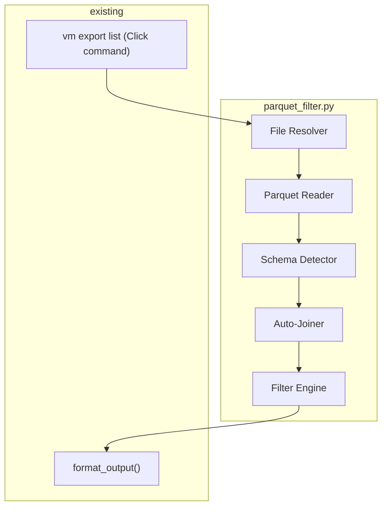

# Design Document: parquet-filter

## Overview

The `vm export list` command reads locally downloaded Parquet files, auto-detects their schema (asset, vulnerability, policy, or remediation), applies user-specified filters (string, numeric, boolean, date, and generic `--where`), optionally joins asset data for cross-table filtering, and outputs results through the existing `format_output` pipeline.

All logic lives in a new `parquet_filter.py` module. The Click command in `solutions/vm.py` is a thin shell that resolves files, calls into `parquet_filter`, and prints the result.

## Architecture



### Data Flow

1. **File Resolver** — Collects Parquet file paths from `--cache` (cwd glob) or `--file` (user glob). Exits if none found.
2. **Parquet Reader** — Reads each file with `pyarrow.parquet.read_table`, converts rows to `list[dict]`. Timestamps → ISO-8601 strings, list columns → Python lists.
3. **Schema Detector** — Inspects column names (metadata only) to classify each file. Priority order: `vulnId` → vulnerability, `benchmarkNaturalId` → policy, `remediationCount` → remediation, `hostName` (fallback) → asset. Unknown files are warned and skipped.
4. **Auto-Joiner** — When non-asset schemas are present alongside asset files, builds an `assetId → asset_row` lookup and enriches non-asset rows. This enables asset-field filters (hostname, IP, OS) on vulnerability/policy/remediation data.
5. **Filter Engine** — Applies all user filters as logical AND. Supports string (case-insensitive substring), numeric (comparison operators), boolean, date (ISO-8601 comparison), and generic `--where column op value`.
6. **Output** — Passes filtered rows to `format_output(data, fmt, limit, search, short)`.

## Components and Interfaces

### parquet_filter.py (new module)

```python
# --- File Resolution ---
def resolve_files(use_cache: bool, file_pattern: str | None) -> list[Path]:
    """Return Parquet file paths. Exits on error."""

# --- Schema Detection ---
SCHEMA_ASSET = "asset"
SCHEMA_VULNERABILITY = "vulnerability"
SCHEMA_POLICY = "policy"
SCHEMA_REMEDIATION = "remediation"

def detect_schema(path: Path) -> str | None:
    """Classify a Parquet file by column names only (reads metadata, not rows).
    Returns schema string or None for unknown files."""

# --- Parquet Reading ---
def read_parquet_files(paths: list[Path]) -> list[dict]:
    """Read Parquet files and return rows as list[dict].
    Converts timestamps to ISO-8601, lists to Python lists."""

# --- Filtering ---
def parse_comparison(expr: str) -> tuple[Callable, str]:
    """Parse '>=9.0' into (operator.ge, '9.0'). Supports >=, <=, >, <, ==, =."""

def apply_filters(rows: list[dict], filters: dict) -> list[dict]:
    """Apply all filter predicates (AND logic). filters is a dict of
    {column: value_or_expr} built from CLI options."""

def apply_where(rows: list[dict], where_clauses: list[str], schema_columns: dict) -> list[dict]:
    """Parse and apply --where 'column op value' clauses."""

# --- Auto-Join ---
def auto_join(primary_rows: list[dict], asset_rows: list[dict]) -> list[dict]:
    """Join primary rows with asset data on assetId. Returns primary rows
    enriched with asset fields for filtering (asset columns stripped from output)."""
```

### solutions/vm.py (additions)

```python
@export.command("list")
@click.option("--file", "file_pattern", default=None, help="File path or glob pattern for Parquet files.")
@click.option("--hostname", default=None, help="Filter by hostname (substring match).")
@click.option("--ip", default=None, help="Filter by IP address (substring match).")
@click.option("--os-family", default=None, help="Filter by OS family (substring match).")
@click.option("--severity", default=None, help="Filter by severity (substring match).")
@click.option("--cvss-score", default=None, help="Filter by CVSS score (e.g. '>=9.0').")
@click.option("--risk-score", default=None, help="Filter by risk score (e.g. '>=10000').")
@click.option("--has-exploits", default=None, help="Filter by exploit availability (true/false).")
@click.option("--first-found", default=None, help="Filter by first-found date (e.g. '>=2025-01-01').")
@click.option("--status", default=None, help="Filter by finalStatus (substring match).")
@click.option("--where", "where_clauses", multiple=True, help="Generic filter: 'column op value'.")
@click.pass_context
def export_list(ctx, file_pattern, hostname, ip, os_family, severity, cvss_score,
                risk_score, has_exploits, first_found, status, where_clauses):
    """Query and filter locally downloaded Parquet export files."""
```

## Data Models

### Schema Detection Rules

| Priority | Column Probe         | Schema         |
|----------|----------------------|----------------|
| 1        | `vulnId`             | vulnerability  |
| 2        | `benchmarkNaturalId` | policy         |
| 3        | `remediationCount`   | remediation    |
| 4        | `hostName`           | asset          |

Detection reads only Parquet metadata (column names), never row data.

### Filter Types

| Type    | CLI Example                        | Matching Logic                                    |
|---------|------------------------------------|---------------------------------------------------|
| String  | `--hostname web`                   | Case-insensitive substring: `"web" in val.lower()`|
| Numeric | `--cvss-score '>=9.0'`             | Parse operator + threshold, compare as float      |
| Boolean | `--has-exploits true`              | Parse `true`/`false` (case-insensitive), compare   |
| Date    | `--first-found '>=2025-01-01'`     | Parse ISO-8601, compare as datetime               |
| Where   | `--where 'severity == Critical'`   | Auto-detect column type from Parquet schema       |

### Comparison Operators

Supported: `>=`, `<=`, `>`, `<`, `==`, `=` (alias for `==`).

### Auto-Join Behavior

When the resolved file set contains both asset files and non-asset files:
- Asset rows are indexed by `assetId`
- Non-asset rows are enriched with asset fields (`hostName`, `ip`, `osFamily`, etc.)
- Asset-specific filters (`--hostname`, `--ip`, `--os-family`) become usable on non-asset schemas
- Output includes only primary schema columns (asset columns used for filtering are stripped)
- If no asset files are present and an asset filter is used on non-asset data, a warning is printed and the filter is ignored


## Correctness Properties

*A property is a characteristic or behavior that should hold true across all valid executions of a system — essentially, a formal statement about what the system should do. Properties serve as the bridge between human-readable specifications and machine-verifiable correctness guarantees.*

### Property 1: Timestamp conversion produces valid ISO-8601

*For any* valid datetime value stored in a Parquet timestamp column, reading it through `read_parquet_files` SHALL produce a string that is a valid ISO-8601 datetime representation of the original value.

**Validates: Requirements 2.2**

### Property 2: String filter is case-insensitive substring match

*For any* row with a string column value `v` and any filter substring `f`, the row SHALL be included by the string filter if and only if `f.lower()` is a substring of `v.lower()`.

**Validates: Requirements 4.1**

### Property 3: Multiple filters compose as logical AND

*For any* set of filter predicates and any row, the row SHALL be included in the filtered output if and only if it satisfies every individual predicate. This applies to both named filter options and `--where` clauses.

**Validates: Requirements 4.2, 8.3**

### Property 4: Numeric comparison filter correctness

*For any* row with a numeric column value `v` (non-null), any supported comparison operator `op`, and any numeric threshold `t`, the row SHALL be included by the numeric filter if and only if `v op t` evaluates to true under standard numeric comparison.

**Validates: Requirements 5.1, 5.2, 5.4**

### Property 5: Date comparison filter correctness

*For any* row with a date/timestamp column value `d` and any supported comparison operator `op` with an ISO-8601 date threshold `t`, the row SHALL be included by the date filter if and only if `d op t` evaluates to true under standard datetime comparison.

**Validates: Requirements 7.1, 7.2**

### Property 6: Auto-join preserves all matching primary rows

*For any* set of primary-schema rows and asset rows, the auto-join on `assetId` SHALL return exactly those primary rows whose `assetId` exists in the asset data, each enriched with the corresponding asset fields.

**Validates: Requirements 9.1**

### Property 7: Comparison operator parsing round-trip

*For any* supported operator symbol (`>=`, `<=`, `>`, `<`, `==`, `=`) and any numeric string value, `parse_comparison(op + value)` SHALL return the correct operator function and the original value string.

**Validates: Requirements 5.2**

## Error Handling

| Condition | Behavior | Exit Code |
|-----------|----------|-----------|
| Neither `--cache` nor `--file` provided | Print usage hint to stderr | 1 |
| No Parquet files found | Print "no Parquet files found" to stderr | 1 |
| Corrupt/unreadable Parquet file | Print error identifying the file to stderr | 2 |
| Invalid numeric filter value | Print error with example usage to stderr | 1 |
| Invalid date filter value | Print error with example usage to stderr | 1 |
| Unknown schema (no matching columns) | Print warning to stderr, skip file | — (continues) |
| Asset filter on non-asset schema without asset files | Print warning to stderr, ignore filter | — (continues) |
| Invalid `--where` syntax | Print error with expected format to stderr | 1 |

All errors use `click.echo(..., err=True)` and `sys.exit(code)` consistent with existing CLI patterns.

## Testing Strategy

### Unit Tests (example-based)

- File resolution: `--cache` returns `*.parquet` from cwd; `--file` resolves glob; `--file` takes precedence over `--cache`; neither flag → exit 1; empty result → exit 1
- Schema detection: each probe column maps to correct schema; unknown columns → warning + skip; priority order (vulnId wins over hostName)
- Boolean filter: `true`/`false`/`True`/`FALSE` all parse correctly
- Error cases: corrupt file → exit 2; unparseable numeric → exit 1; unparseable date → exit 1; invalid `--where` syntax → exit 1
- Auto-join: asset columns stripped from output; warning when asset files missing
- Command registration: `vm export list --help` works; no API key required

### Property-Based Tests (Hypothesis)

The project already has `hypothesis>=6.0` in dev dependencies.

Each property test runs a minimum of 100 iterations and is tagged with:
`Feature: parquet-filter, Property {N}: {title}`

| Property | Test Description | Generator Strategy |
|----------|------------------|--------------------|
| 1 | Timestamp ISO-8601 conversion | `st.datetimes()` → write to parquet → read back → verify ISO format |
| 2 | String filter correctness | `st.text()` for values and filters → verify case-insensitive substring |
| 3 | Filter AND composition | `st.lists(st.dictionaries(...))` for rows + multiple filter predicates → verify AND |
| 4 | Numeric comparison | `st.floats(allow_nan=False)` for values + `st.sampled_from(ops)` + `st.floats()` for thresholds |
| 5 | Date comparison | `st.datetimes()` for values + `st.sampled_from(ops)` + `st.datetimes()` for thresholds |
| 6 | Auto-join correctness | `st.lists(st.fixed_dictionaries({assetId: st.text(), ...}))` for both sides → verify join |
| 7 | Comparison operator parsing | `st.sampled_from([">=","<=",">","<","==","="])` + `st.from_regex(r"\d+\.?\d*")` → verify round-trip |


## Post-Implementation Changes

- `--file` renamed to `--files`
- `--only` column projection option added
- Policy-specific filters added: `--benchmark-title`, `--profile-title`, `--publisher`, `--rule-title`, `--benchmark-version`
- String matching updated to support glob patterns (`*`, `?`) via `fnmatch`
- Auto-search of current directory when no `--files` or `--cache` specified
- Schema detection uses `path.resolve()` for absolute paths
- Only most recent file per schema is used (avoids duplicates)
- Asset column validation for `--only` option
