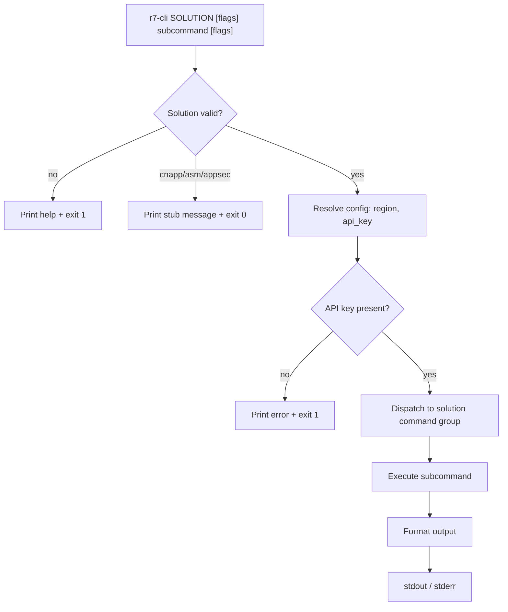
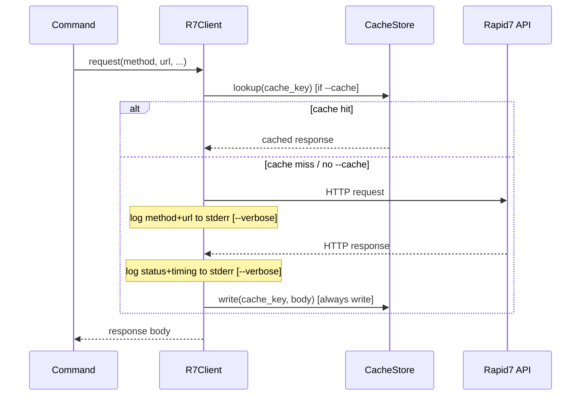

# Design Document: r7-cli

## Overview

`r7-cli` is a Python command-line tool that provides a unified interface to Rapid7's Insight Platform public APIs. It replaces ad-hoc bash scripts and JSON files with a single, consistent CLI organized by product solution.

The tool is invoked as:

```
r7-cli $SOLUTION [-r $REGION] [-v] [subcommand] [flags]
```

Valid solutions: `siem`, `vm`, `cnapp`, `asm`, `appsec`, `drp`, `platform`

### Key Design Goals

- Single binary-style entry point dispatching to per-solution command groups
- Consistent flag conventions (short + long forms) across all subcommands
- Cross-cutting concerns (auth, output formatting, caching, verbose/debug) handled at the framework layer, not per-command
- Async job lifecycle (submit → poll → download) abstracted into reusable primitives
- Local state (`~/.r7-cli/`) for cache and job persistence

### Technology Choices

| Concern | Library |
|---|---|
| CLI framework | [Click](https://click.palletsprojects.com/) (groups + commands, short/long flags, help generation) |
| HTTP client | [httpx](https://www.python-httpx.org/) (sync, with response timing) |
| Parquet reading | [pyarrow](https://arrow.apache.org/docs/python/) |
| Output tables | [tabulate](https://pypi.org/project/tabulate/) |
| Property-based testing | [Hypothesis](https://hypothesis.readthedocs.io/) |
| Unit testing | [pytest](https://pytest.org/) |

---

## Architecture

The codebase is organized as a Python package `r7cli` with the following top-level structure:

```
r7cli/
  __init__.py
  main.py            # Entry point: top-level Click group, solution dispatch
  config.py          # Config resolution (env vars, flags, defaults)
  client.py          # HTTP client wrapper (auth, verbose/debug, timing, caching)
  output.py          # Output formatting (json/table/csv)
  cache.py           # Local response cache (~/.r7-cli/cache/)
  jobs.py            # Job ID persistence (~/.r7-cli/jobs.json)
  solutions/
    vm.py            # InsightVM commands (export, job, scans, engines, health)
    siem.py          # InsightIDR commands (health-metrics, logs, quarantine, etc.)
    drp.py           # DRP commands (assets, alerts, phishing, ssl, etc.)
    platform.py      # Platform commands (search, validate, surface command)
    stub.py          # Stub for cnapp, asm, appsec
  models.py          # Dataclasses / TypedDicts for structured data
tests/
  test_config.py
  test_client.py
  test_output.py
  test_cache.py
  test_jobs.py
  test_vm.py
  test_siem.py
  test_drp.py
  test_platform.py
  test_properties.py  # All property-based tests
```

### Dispatch Flow



### Request Lifecycle



---

## Components and Interfaces

### `config.py` — Config Resolution

```python
@dataclass
class Config:
    region: str          # resolved region (default: "us")
    api_key: str         # R7_X_API_KEY or --api-key
    drp_token: str       # R7_DRP_TOKEN or --drp-token
    verbose: bool
    debug: bool
    output_format: str   # "json" | "table" | "csv"
    use_cache: bool
    limit: int | None

def resolve_config(ctx: click.Context) -> Config: ...
```

Resolution priority for `region`: `--region` flag → `R7_REGION` env → `"us"`.
Resolution priority for `api_key`: `--api-key` flag → `R7_X_API_KEY` env.
`us1` is normalized to `us` at resolution time.

Base URLs derived from config:

```python
INSIGHT_BASE  = "https://{region}.api.insight.rapid7.com"
IVM_BULK_GQL  = "https://{region}.api.insight.rapid7.com/vm/graphql"
IDR_LOGS_BASE = "https://{region}.rest.logs.insight.rapid7.com"
IDR_GQL       = "https://{region}.api.insight.rapid7.com/graphql"
SC_BASE       = "https://{region}.api.insight.rapid7.com/surface"
DRP_BASE      = "https://api.ti.insight.rapid7.com"
```

### `client.py` — HTTP Client

```python
class R7Client:
    def __init__(self, config: Config): ...

    def request(
        self,
        method: str,
        url: str,
        *,
        json: dict | None = None,
        params: dict | None = None,
        auth: tuple | None = None,   # for DRP Basic auth
        headers: dict | None = None,
    ) -> httpx.Response: ...

    def get(self, url, **kwargs) -> httpx.Response: ...
    def post(self, url, **kwargs) -> httpx.Response: ...
    def head(self, url, **kwargs) -> httpx.Response: ...
```

Responsibilities:
- Injects `X-Api-Key` header (redacted in verbose output)
- Logs `METHOD URL` to stderr before request (verbose)
- Logs `STATUS timing_ms` to stderr after response (verbose)
- Logs full request/response bodies to stderr (debug, with key redaction)
- Checks `config.use_cache`; reads from / writes to `CacheStore`
- Raises typed exceptions mapped to exit codes (see Error Handling)

### `cache.py` — Local Response Cache

```python
CACHE_DIR = Path.home() / ".r7-cli" / "cache"

def cache_key(solution: str, subcommand: str, region: str, url: str, params: dict) -> str:
    """Deterministic SHA-256 hex digest of the logical request identity."""
    ...

class CacheStore:
    def read(self, key: str) -> dict | None: ...
    def write(self, key: str, body: dict) -> None: ...
```

Cache files are stored as `~/.r7-cli/cache/{key}.json`. Write failures print a warning to stderr and are non-fatal.

### `jobs.py` — Job ID Persistence

```python
JOBS_FILE = Path.home() / ".r7-cli" / "jobs.json"

@dataclass
class JobEntry:
    job_id: str
    export_type: str          # "vulnerabilities" | "policies" | "remediations"
    created_at: str           # ISO-8601 timestamp
    status: str               # "ACTIVE" | "SUCCEEDED" | "FAILED"

class JobStore:
    def add(self, entry: JobEntry) -> None: ...
    def get_latest(self, export_type: str) -> JobEntry | None: ...
    def get_active(self, export_type: str) -> list[JobEntry]: ...
    def remove(self, job_id: str) -> None: ...
    def mark_terminal(self, job_id: str, status: str) -> None: ...
```

### `output.py` — Output Formatting

```python
def format_output(data: Any, fmt: str, limit: int | None = None) -> str:
    """
    fmt: "json" | "table" | "csv"
    limit: if set, truncates the largest top-level array to N items.
    """
    ...

def apply_limit(data: Any, limit: int) -> Any:
    """Find the largest top-level array field and truncate it to limit."""
    ...
```

### `main.py` — Entry Point

```python
@click.group()
@click.argument("solution", required=True)
@click.option("-r", "--region", ...)
@click.option("-v", "--verbose", is_flag=True)
@click.option("-k", "--api-key", ...)
@click.option("-o", "--output", default="json", ...)
@click.option("-c", "--cache", is_flag=True)
@click.option("-l", "--limit", type=int)
@click.option("--debug", is_flag=True)
def cli(solution, ...): ...
```

Solution dispatch is implemented via Click's `CommandCollection` or manual dispatch in the group callback, routing to the appropriate `solutions/*.py` Click group.

### Solution Modules

Each solution module exposes a Click `Group`:

```python
# solutions/vm.py
@click.group()
def vm(): ...

@vm.group()
def export(): ...

@export.command("vulnerabilities")
@click.option("-w", "--wait", is_flag=True)
@click.option("-a", "--auto", is_flag=True)
@click.option("--output-dir", type=click.Path())
def export_vulnerabilities(wait, auto, output_dir): ...
```

---

## Data Models

### Job Entry (jobs.json)

```python
@dataclass
class JobEntry:
    job_id: str
    export_type: str   # "vulnerabilities" | "policies" | "remediations"
    created_at: str    # ISO-8601
    status: str        # "ACTIVE" | "SUCCEEDED" | "FAILED"
```

Persisted as a JSON array in `~/.r7-cli/jobs.json`:

```json
[
  {
    "job_id": "abc123",
    "export_type": "vulnerabilities",
    "created_at": "2024-01-15T10:30:00Z",
    "status": "ACTIVE"
  }
]
```

### Cache Key

The cache key is a SHA-256 hex digest of the concatenation of:
`solution + "|" + subcommand + "|" + region + "|" + url + "|" + sorted_params_json`

### Config

```python
VALID_REGIONS = {"us", "us2", "us3", "ca", "eu", "au", "ap", "me-central-1", "ap-south-2"}
REGION_ALIASES = {"us1": "us"}
VALID_SOLUTIONS = {"siem", "vm", "cnapp", "asm", "appsec", "drp", "platform"}
STUB_SOLUTIONS = {"cnapp", "asm", "appsec"}
VALID_OUTPUT_FORMATS = {"json", "table", "csv"}
VALID_SEARCH_TYPES = {"VULNERABILITY", "ASSET", "SCAN", "SCHEDULE", "APP"}
EXIT_SUCCESS = 0
EXIT_USER_ERROR = 1
EXIT_API_ERROR = 2
EXIT_NETWORK_ERROR = 3
```

### GraphQL Mutations / Queries

```python
GQL_CREATE_VULN_EXPORT = """
mutation CreateVulnerabilityExport {
  createVulnerabilityExport(input:{}) { id }
}
"""

GQL_CREATE_POLICY_EXPORT = """
mutation CreatePolicyExport {
  createPolicyExport(input:{}) { id }
}
"""

GQL_CREATE_REMEDIATION_EXPORT = """
mutation CreateVulnerabilityRemediationExport($start: String!, $end: String!) {
  createVulnerabilityRemediationExport(input:{ startDate: $start, endDate: $end }) { id }
}
"""

GQL_GET_EXPORT = """
query GetExport($id: String!) {
  export(id: $id) { id status dataset timestamp result { prefix urls } }
}
"""

GQL_QUARANTINE_STATE = """
query QuarantineState($cursor: String) {
  assets(first: 10000, after: $cursor) {
    pageInfo { endCursor hasNextPage }
    nodes {
      agent { id agentStatus quarantineState { currentState } beaconTime }
      host { hostNames { name } primaryAddress { ip } }
    }
  }
}
"""
```

---

## Correctness Properties

*A property is a characteristic or behavior that should hold true across all valid executions of a system — essentially, a formal statement about what the system should do. Properties serve as the bridge between human-readable specifications and machine-verifiable correctness guarantees.*

### Property 1: Config Resolution Priority

*For any* combination of `--api-key` flag value, `R7_X_API_KEY` env value, `--region` flag value, and `R7_REGION` env value, the resolved `Config` object must satisfy: (a) `api_key` equals the flag value when the flag is set, otherwise the env value; (b) `region` equals the flag value when the flag is set, otherwise the env value when set, otherwise `"us"`; (c) `us1` is always normalized to `"us"`.

**Validates: Requirements 1.2, 1.3, 1.4**

### Property 2: Invalid Solution Rejects with Non-Zero Exit

*For any* string that is not in `{"siem", "vm", "cnapp", "asm", "appsec", "drp", "platform", "help", "-h", "--help"}`, invoking `r7-cli` with that string as the solution argument must exit with a non-zero status code.

**Validates: Requirements 1a.4**

### Property 3: Invalid Region Rejects with Non-Zero Exit

*For any* string that is not in the set of valid region codes (and not a valid alias), providing it via `-r` or `R7_REGION` must cause the CLI to exit with a non-zero status code. Conversely, *for any* valid region code, config resolution must succeed without error.

**Validates: Requirements 17.1, 17.2**

### Property 4: Date Range Validation

*For any* pair of date strings `(start, end)` where `start` is chronologically later than `end`, invoking `vm export remediations --start-date start --end-date end` must exit with a non-zero status code and print an error message.

**Validates: Requirements 4.3**

### Property 5: Output Format Round-Trip

*For any* list of dicts representing structured API data: (a) formatting as `json` then parsing the result with `json.loads` must produce an equivalent object; (b) formatting as `csv` then parsing with `csv.DictReader` must produce rows with the same keys and values as the original dicts.

**Validates: Requirements 8.1, 8.2, 8.4**

### Property 6: Table Output Contains Column Headers

*For any* non-empty list of dicts, formatting as `table` must produce a string that contains each key from the dicts as a column header.

**Validates: Requirements 8.3**

### Property 7: Credential Redaction in Verbose Output

*For any* non-empty API key string and any DRP token string, the verbose/debug output produced by `R7Client` must not contain the literal value of the API key or DRP token anywhere in the output.

**Validates: Requirements 9.3, 18.6**

### Property 8: Exit Code Mapping

*For any* command execution: a successful response must produce exit code `0`; a user input error (missing flag, invalid argument) must produce exit code `1`; an HTTP 4xx/5xx API response must produce exit code `2`; a network connectivity failure must produce exit code `3`.

**Validates: Requirements 10.1, 10.2, 10.3, 10.4**

### Property 9: RFC-1918 IP Filtering

*For any* IP address string, the private-IP classifier must return `True` for addresses in `10.0.0.0/8`, `172.16.0.0/12`, and `192.168.0.0/16`, and `False` for all other valid IPv4 addresses.

**Validates: Requirements 15.1**

### Property 10: Limit Truncation

*For any* JSON-serializable data structure containing at least one array field, and *for any* positive integer `N`, applying `apply_limit(data, N)` must produce a result where the largest array field has length `min(original_length, N)` and all other fields are unchanged.

**Validates: Requirements 36.3, 36.6**

### Property 11: Invalid Limit Rejects with Non-Zero Exit

*For any* non-positive integer or non-numeric string provided as the `--limit` value, the CLI must exit with a non-zero status code.

**Validates: Requirements 36.2**

### Property 12: Cache Key Determinism

*For any* fixed combination of `(solution, subcommand, region, url, params)`, calling `cache_key(...)` multiple times must always return the same string.

**Validates: Requirements 37.2**

### Property 13: Cache Round-Trip

*For any* JSON-serializable dict `body` and any cache key `k`, writing `body` to the cache under key `k` and then reading it back must produce an equivalent dict.

**Validates: Requirements 37.3, 37.4**

### Property 14: Job Store Latest Selection

*For any* non-empty list of `JobEntry` objects with the same `export_type`, `JobStore.get_latest(export_type)` must return the entry with the most recent `created_at` timestamp.

**Validates: Requirements 38.2**

### Property 15: Job Store Terminal Removal

*For any* `JobEntry` that has been added to the `JobStore`, calling `mark_terminal(job_id, status)` with a terminal status must result in that entry no longer appearing in `get_active(export_type)`.

**Validates: Requirements 38.4**

### Property 16: Short/Long Flag Equivalence

*For any* flag that has both a short form and a long form, providing the short form must produce the same resolved `Config` or command behavior as providing the long form with the same value.

**Validates: Requirements 35.1, 35.2, 35.3**

### Property 17: Threshold Exit Code (Risk Score)

*For any* numeric risk score `s` and threshold `t`, invoking `drp risk-score --fail-above t` against a mock that returns `s` must exit with a non-zero status code if and only if `s > t`.

**Validates: Requirements 25.2**

### Property 18: Threshold Exit Code (Log Retention)

*For any* retention period in milliseconds `r` and threshold in days `d`, invoking `idr log-retention --min-days d` against a mock that returns `r` must exit with a non-zero status code if and only if `r / 86400000 < d`.

**Validates: Requirements 30.2**

---

## Error Handling

### Exception Hierarchy

```python
class R7Error(Exception):
    exit_code: int

class UserInputError(R7Error):
    exit_code = 1   # missing flag, invalid argument, invalid region, etc.

class APIError(R7Error):
    exit_code = 2   # HTTP 4xx / 5xx
    status_code: int
    body: str

class NetworkError(R7Error):
    exit_code = 3   # connection refused, timeout, DNS failure
```

The top-level Click group catches all `R7Error` subclasses, prints the message to stderr, and calls `sys.exit(error.exit_code)`.

### Error Scenarios

| Scenario | Exception | Exit Code |
|---|---|---|
| Missing API key | `UserInputError` | 1 |
| Invalid region | `UserInputError` | 1 |
| Invalid solution | `UserInputError` | 1 |
| Invalid `--limit` value | `UserInputError` | 1 |
| Missing required flag | `UserInputError` | 1 |
| `--start-date` > `--end-date` | `UserInputError` | 1 |
| Both `--query` and `--query-file` | `UserInputError` | 1 |
| HTTP 4xx / 5xx | `APIError` | 2 |
| Export job `FAILED` | `APIError` | 2 |
| DRP 401 on validate | `APIError` | 2 |
| Connection refused / timeout | `NetworkError` | 3 |
| DNS resolution failure | `NetworkError` | 3 |

### Rate Limiting (IDR Logs)

When the IDR log storage endpoint returns HTTP 429, the client reads the `X-RateLimit-Reset` header and sleeps for that many seconds before retrying. This is handled transparently in `R7Client.request()`.

### Export Job Conflict (FAILED_PRECONDITION)

When a bulk export mutation returns a GraphQL error with `errorType: FAILED_PRECONDITION`, the client extracts the in-progress `exportId` from the error message using a regex, then proceeds to poll that job ID instead of failing.

### Cache Write Failures

If writing a cache file raises an `OSError`, the client logs a warning to stderr and continues without caching. This is non-fatal.

---

## Testing Strategy

### Dual Testing Approach

Both unit tests and property-based tests are required. They are complementary:

- **Unit tests** verify specific examples, integration points, edge cases, and error conditions using `pytest` with `unittest.mock` for HTTP mocking.
- **Property-based tests** verify universal properties across many generated inputs using `Hypothesis`.

### Property-Based Testing Configuration

Library: **Hypothesis** (`pip install hypothesis`)

Each property-based test must:
- Run a minimum of **100 iterations** (configured via `@settings(max_examples=100)`)
- Include a comment referencing the design property it validates
- Use `@given` with appropriate `st.*` strategies

Tag format in comments:
```python
# Feature: r7-cli, Property N: <property_text>
```

Each correctness property from the design document must be implemented by exactly one `@given`-decorated test function.

### Unit Test Examples

```python
# test_config.py
def test_missing_api_key_exits_nonzero():
    result = runner.invoke(cli, ["vm", "health"], env={})
    assert result.exit_code == 1

def test_us1_normalized_to_us():
    config = resolve_config(region_flag="us1", region_env=None)
    assert config.region == "us"

# test_output.py
def test_json_output_default():
    result = format_output({"key": "val"}, fmt="json")
    assert json.loads(result) == {"key": "val"}

# test_vm.py
def test_export_vuln_sends_correct_mutation(mock_client):
    # verifies the GraphQL mutation body
    ...

def test_conflict_detection_polls_existing_job(mock_client):
    # mock returns FAILED_PRECONDITION with exportId, verify polling
    ...
```

### Property-Based Test Examples

```python
from hypothesis import given, settings, strategies as st

# Feature: r7-cli, Property 1: Config resolution priority
@given(
    api_key_flag=st.one_of(st.none(), st.text(min_size=1)),
    api_key_env=st.one_of(st.none(), st.text(min_size=1)),
    region_flag=st.one_of(st.none(), st.sampled_from(list(VALID_REGIONS))),
    region_env=st.one_of(st.none(), st.sampled_from(list(VALID_REGIONS))),
)
@settings(max_examples=100)
def test_config_resolution_priority(api_key_flag, api_key_env, region_flag, region_env):
    config = resolve_config(api_key_flag=api_key_flag, api_key_env=api_key_env,
                            region_flag=region_flag, region_env=region_env)
    expected_key = api_key_flag if api_key_flag else api_key_env
    assert config.api_key == expected_key
    expected_region = region_flag or region_env or "us"
    assert config.region == REGION_ALIASES.get(expected_region, expected_region)

# Feature: r7-cli, Property 10: Limit truncation
@given(
    data=st.fixed_dictionaries({
        "items": st.lists(st.integers(), min_size=0, max_size=50),
        "meta": st.text(),
    }),
    n=st.integers(min_value=1, max_value=100),
)
@settings(max_examples=100)
def test_apply_limit_truncates_largest_array(data, n):
    result = apply_limit(data, n)
    assert len(result["items"]) == min(len(data["items"]), n)
    assert result["meta"] == data["meta"]

# Feature: r7-cli, Property 7: Credential redaction
@given(
    api_key=st.text(min_size=1, alphabet=st.characters(blacklist_categories=("Cs",))),
    url=st.just("https://us.api.insight.rapid7.com/validate"),
)
@settings(max_examples=100)
def test_api_key_never_appears_in_verbose_output(api_key, url, capsys):
    client = R7Client(Config(api_key=api_key, verbose=True, ...))
    # invoke with mock transport
    ...
    captured = capsys.readouterr()
    assert api_key not in captured.err
```

### Test File Organization

| File | Contents |
|---|---|
| `tests/test_config.py` | Unit tests for config resolution, region normalization, error cases |
| `tests/test_client.py` | Unit tests for HTTP client, verbose output, rate-limit retry |
| `tests/test_output.py` | Unit tests for json/table/csv formatting, default format |
| `tests/test_cache.py` | Unit tests for cache key derivation, read/write, write failure |
| `tests/test_jobs.py` | Unit tests for job store CRUD, terminal removal, interactive selection |
| `tests/test_vm.py` | Unit tests for all `vm` subcommands with mock HTTP |
| `tests/test_siem.py` | Unit tests for all `siem` subcommands with mock HTTP |
| `tests/test_drp.py` | Unit tests for all `drp` subcommands with mock HTTP |
| `tests/test_platform.py` | Unit tests for all `platform` subcommands with mock HTTP |
| `tests/test_properties.py` | All 18 property-based tests (one per design property) |
