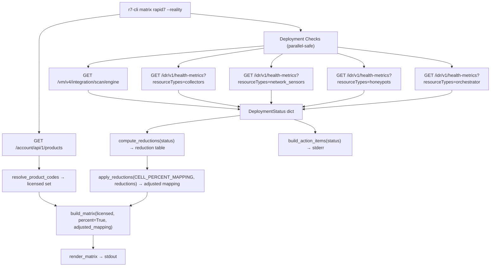

# Design Document: reality-check

## Overview

The `--reality` / `--deployment` flag extends the existing `matrix rapid7` subcommand in `security_checklist.py` to adjust coverage percentages based on actual deployment state. When enabled, the command:

1. **Queries** five Rapid7 deployment APIs to determine which infrastructure components are deployed (scan engines, collectors, network sensors, honeypots, orchestrators).
2. **Computes** per-product, per-cell percentage reductions based on missing deployments using a static reduction rule table.
3. **Adjusts** the `CELL_PERCENT_MAPPING` percentages by applying reductions before the cell total is computed.
4. **Renders** the adjusted matrix in the same grid format as `--percent` mode.
5. **Prints** action items to stderr listing missing components and the coverage improvement deploying them would provide.

The feature reuses `R7Client` for HTTP, `IVM_V4_BASE` and `IDR_V1_BASE` URL templates from `models.py`, and the existing `evaluate_cell_percent` / `build_matrix` / `render_matrix` pipeline. The only file modified is `security_checklist.py` — no new modules are needed.

## Architecture



### Key Design Decisions

1. **Single-file change** — All new logic lives in `security_checklist.py` alongside the existing matrix command. The feature is a natural extension of the percent-mode pipeline, not a separate concern.

2. **Pure reduction functions** — `compute_reductions` and `apply_reductions` are pure functions that take deployment status and the static mapping, returning a new adjusted mapping. This keeps the logic testable without HTTP mocking.

3. **Adjusted mapping passed through existing pipeline** — Rather than modifying `evaluate_cell_percent` or `build_matrix`, the adjusted mapping is passed as an optional parameter. When provided, `build_matrix` uses it instead of the module-level `CELL_PERCENT_MAPPING`. This minimizes changes to existing code paths.

4. **Fail-open on API errors** — If any deployment check API call fails, the component is treated as missing (worst-case assumption). A warning is logged to stderr. This matches the defensive posture: if we can't confirm deployment, assume it's not there.

5. **Reduction stacking with floor** — Multiple reductions for the same product in the same cell are summed. The product-level contribution is clamped to `max(0, original - total_reduction)`. The cell total is clamped to `[0, 100]`. This is implemented in `apply_reductions` before the existing `evaluate_cell_percent` logic runs.

6. **`--reality` implies `--percent`** — Since reality adjustments only make sense in percentage mode, passing `--reality` without `--percent` automatically enables percent display. This avoids a confusing error or silent no-op.

## Components and Interfaces

### 1. Flag Registration (modified Click command)

```python
@matrix.command("rapid7")
@click.option("-p", "--percent", is_flag=True, help="Show coverage percentages instead of checkmarks.")
@click.option("--solution", is_flag=True, help="Show Rapid7 solution names mapped to each cell.")
@click.option("--reality/--no-reality", "--deployment/--no-deployment", default=False,
              help="Adjust percentages based on actual deployment state.")
@click.pass_context
def rapid7(ctx, percent, solution, reality): ...
```

The `--reality` and `--deployment` flags are aliases for the same boolean parameter via Click's flag declaration syntax.

### 2. `check_deployments(client, config) -> dict[str, bool]`

New pure-ish function that queries the five deployment APIs and returns a status dict:

```python
def check_deployments(client: R7Client, config: Config) -> dict[str, bool]:
    """Query deployment APIs and return presence status for each component.
    
    Returns dict with keys: 'scan_engines', 'collectors', 'network_sensors', 
    'honeypots', 'orchestrator'. Values are True if at least one instance exists.
    """
```

Each check is wrapped in a try/except that catches `R7Error`, logs a warning to stderr, and defaults to `False` (missing).

### 3. `compute_reductions(deployment_status: dict[str, bool]) -> dict[tuple[str, str | None], int]`

Pure function that maps missing deployments to reduction rules:

```python
def compute_reductions(status: dict[str, bool]) -> list[tuple[str, str | None, int]]:
    """Compute reduction rules from deployment status.
    
    Returns list of (product_name, nist_stage_or_none, reduction_percent) tuples.
    stage=None means all stages.
    """
```

Reduction rules (static):
| Missing Component | Product | Stage Scope | Reduction |
|---|---|---|---|
| scan_engines | insightVM | all | 25% |
| collectors | insightIDR | all | 50% |
| network_sensors | insightIDR | all | 25% |
| honeypots | insightIDR | all | 10% |
| orchestrator | insightIDR | DETECT only | 10% |

### 4. `apply_reductions(mapping, reductions) -> adjusted_mapping`

Pure function that creates a new mapping with reduced percentages:

```python
def apply_reductions(
    mapping: dict[tuple[str, str], list[tuple[str, int]] | None],
    reductions: list[tuple[str, str | None, int]],
) -> dict[tuple[str, str], list[tuple[str, int]] | None]:
    """Apply deployment reductions to CELL_PERCENT_MAPPING.
    
    Returns a new mapping with adjusted percentages. Product-level 
    contributions are floored at 0.
    """
```

### 5. `build_action_items(deployment_status: dict[str, bool]) -> str`

Pure function that builds the action items text:

```python
def build_action_items(status: dict[str, bool]) -> str:
    """Build action items string for missing deployments.
    
    Returns empty string if all components are deployed.
    """
```

### 6. Modified `build_matrix` signature

```python
def build_matrix(
    licensed: set[str],
    percent: bool = False,
    solution: bool = False,
    adjusted_mapping: dict[tuple[str, str], list[tuple[str, int]] | None] | None = None,
) -> list[list[str]]:
```

When `adjusted_mapping` is provided and `percent=True`, uses it instead of `CELL_PERCENT_MAPPING`.

## Data Models

### Deployment Status

```python
# Return type of check_deployments()
DeploymentStatus = dict[str, bool]
# Example:
{
    "scan_engines": True,      # at least one scan engine found
    "collectors": False,       # no collectors found
    "network_sensors": True,   # at least one network sensor found
    "honeypots": False,        # no honeypots found
    "orchestrator": False,     # no orchestrator found
}
```

### Reduction Rule

```python
# Each reduction rule is a tuple:
# (product_name, nist_stage_or_none, reduction_percent)
# stage=None means applies to all stages
ReductionRule = tuple[str, str | None, int]

# Static reduction table:
REDUCTION_RULES: list[tuple[str, str, str | None, int]] = [
    # (component_key, product, stage_scope, reduction)
    ("scan_engines",    "insightVM",  None,     25),
    ("collectors",      "insightIDR", None,     50),
    ("network_sensors", "insightIDR", None,     25),
    ("honeypots",       "insightIDR", None,     10),
    ("orchestrator",    "insightIDR", "DETECT", 10),
]
```

### Action Item Messages

```python
ACTION_ITEM_MESSAGES: dict[str, str] = {
    "scan_engines":    "Deploy scan engines to increase insightVM coverage by 25%",
    "collectors":      "Deploy collectors to increase insightIDR coverage by 50%",
    "network_sensors": "Deploy network sensors to increase insightIDR coverage by 25%",
    "honeypots":       "Deploy honeypots to increase insightIDR coverage by 10%",
    "orchestrator":    "Deploy orchestrator to increase insightIDR DETECT coverage by 10%",
}
```

### Scan Engine API Response

```python
# GET /vm/v4/integration/scan/engine returns:
{
    "data": [
        {"id": "...", "name": "...", "status": "HEALTHY", ...},
        ...
    ]
}
# Count items in "data" array; zero means no scan engines deployed.
```

### Health Metrics API Response

```python
# GET /idr/v1/health-metrics?resourceTypes=collectors returns:
# A list or dict containing resource entries.
# The _extract_items pattern from siem.py is reused to find the largest list of dicts.
# Zero items means the component type is not deployed.
```


## Correctness Properties

*A property is a characteristic or behavior that should hold true across all valid executions of a system — essentially, a formal statement about what the system should do. Properties serve as the bridge between human-readable specifications and machine-verifiable correctness guarantees.*

### Property 1: Reduction Correctness

*For any* deployment status (a dict mapping each of the 5 component keys to True/False) and *for any* cell `(stage, asset_type)` in `CELL_PERCENT_MAPPING` that contains product entries, the adjusted percentage for each product in that cell SHALL equal `max(0, original_percent - total_applicable_reduction)`, where `total_applicable_reduction` is the sum of all reduction rules whose product matches and whose stage scope is either `None` (all stages) or matches the cell's NIST stage, and whose component is marked as missing in the deployment status.

Specifically:
- If scan_engines is missing: insightVM entries lose 25% in all stages.
- If collectors is missing: insightIDR entries lose 50% in all stages.
- If network_sensors is missing: insightIDR entries lose 25% in all stages.
- If honeypots is missing: insightIDR entries lose 10% in all stages.
- If orchestrator is missing: insightIDR entries lose 10% in DETECT stage only.
- Reductions for the same product in the same cell stack additively.

**Validates: Requirements 7.1, 7.2, 8.1, 8.2, 9.1, 9.2, 10.1, 10.2, 11.1, 11.2, 12.1**

### Property 2: Product Contribution Floor

*For any* adjusted mapping produced by `apply_reductions`, every product-level percentage in every cell SHALL be >= 0. No combination of stacked reductions shall produce a negative product contribution.

**Validates: Requirements 12.2**

### Property 3: Cell Total Bounds

*For any* adjusted mapping and *for any* set of licensed product names, the total percentage computed by `evaluate_cell_percent` for every cell SHALL be in the range [0, 100].

**Validates: Requirements 12.3**

### Property 4: Action Items Completeness

*For any* deployment status dict, `build_action_items` SHALL include an action item line for every component marked as missing (False) and SHALL include no action item lines for components marked as present (True). When all components are present, the output SHALL be an empty string.

**Validates: Requirements 13.1, 13.7**

## Error Handling

| Condition | Source | Behavior | Exit Code |
|---|---|---|---|
| `--reality` + `--solution` | Flag validation in `rapid7()` | Print error to stderr, exit | 1 |
| Scan engine API failure | `check_deployments()` catch `R7Error` | Log warning to stderr, treat as missing | N/A (continues) |
| Collector API failure | `check_deployments()` catch `R7Error` | Log warning to stderr, treat as missing | N/A (continues) |
| Network sensor API failure | `check_deployments()` catch `R7Error` | Log warning to stderr, treat as missing | N/A (continues) |
| Honeypot API failure | `check_deployments()` catch `R7Error` | Log warning to stderr, treat as missing | N/A (continues) |
| Orchestrator API failure | `check_deployments()` catch `R7Error` | Log warning to stderr, treat as missing | N/A (continues) |
| Products API failure | Existing `R7Error` handling in `rapid7()` | Print error to stderr, exit | 2 or 3 |
| Missing/invalid API key | Existing `APIError` from `R7Client` | "No API key provided…" or "not authorized…" | 2 |
| Network error (timeout, DNS) | Existing `NetworkError` from `R7Client` | Propagated from httpx | 3 |

The fail-open pattern for deployment checks is deliberate: the matrix should still render with worst-case reductions rather than failing entirely when a single deployment API is unreachable.

## Testing Strategy

### Property-Based Tests (using Hypothesis)

Hypothesis is already available in the project's dev dependencies. Each property test runs a minimum of 100 iterations.

| Property | Test Description | Tag |
|---|---|---|
| Property 1 | Generate random deployment status dicts (5 booleans) and apply reductions to `CELL_PERCENT_MAPPING`. For each cell and product, verify the adjusted percentage equals `max(0, original - sum_of_applicable_reductions)`. | `Feature: reality-check, Property 1: Reduction correctness` |
| Property 2 | Generate random `CELL_PERCENT_MAPPING`-shaped dicts with random product percentages (0–200) and random deployment statuses. Apply reductions and verify every product percentage in the result is >= 0. | `Feature: reality-check, Property 2: Product contribution floor` |
| Property 3 | Generate random adjusted mappings and random licensed product sets. Call `evaluate_cell_percent` for every cell and verify the result parses to an integer in [0, 100] or is "N/A". | `Feature: reality-check, Property 3: Cell total bounds` |
| Property 4 | Generate random deployment status dicts. Call `build_action_items` and verify: each missing component has exactly one corresponding action item line, each present component has no line, and all-True produces empty string. | `Feature: reality-check, Property 4: Action items completeness` |

### Unit Tests (example-based)

- `--reality` flag is recognized by the `rapid7` command
- `--deployment` flag behaves identically to `--reality`
- `--reality` without `--percent` implicitly enables percent mode
- `--reality` + `--solution` produces mutual exclusivity error
- `check_deployments` with mocked API returning empty lists → all False
- `check_deployments` with mocked API returning populated lists → all True
- `check_deployments` with mocked API failure → warning logged, component treated as missing
- `compute_reductions` with all deployed → empty reduction list
- `compute_reductions` with all missing → 5 reduction rules
- `apply_reductions` with no reductions → mapping unchanged
- Specific action item messages match exact required strings (Req 13.2–13.6)
- All deployed → no action items section (Req 13.7)
- Output uses grid format with `--reality` (Req 14.1)
- Stderr header mentions deployment-adjusted percentages (Req 14.2)

### Integration Tests (mocked API)

- Full pipeline: mock Products API + all 5 deployment APIs, verify adjusted matrix output
- Full pipeline with all components deployed: verify matrix matches standard `--percent` output
- Full pipeline with all components missing: verify maximum reductions applied
- `--cache` mode with `--reality`: verify deployment APIs are still called (cache only applies to products)


## Post-Implementation Changes

- Additional deployment checks added beyond the original 5: event sources (no event sources → -75%, fewer than 5 → -50%), stale/offline agents (dynamic: 10% reduction per 10% unhealthy), active InsightConnect workflows (no workflows → -10% DETECT), Surface Command connectors (fewer than 5 third-party → -50%)
- `--scoring` flag added to print all scoring rules
- `--json` flag added for JSON matrix output
- `build_recommendations()` added for product recommendations
