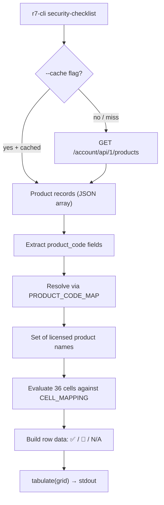

# Design Document: security-checklist

## Overview

The `security-checklist` command is a new top-level CLI command registered on the `SolutionGroup` multi-command in `main.py`. It provides a single-step pipeline:

1. **Fetch** — Call the Products API (`ACCOUNT_BASE + "/products"`) via `R7Client` to retrieve the user's licensed Rapid7 products.
2. **Resolve** — Extract `product_code` from each record and map it to a canonical product name using the static `PRODUCT_CODE_MAP`.
3. **Evaluate** — For each of the 36 cells in the 6×6 matrix (NIST CSF stages × CIS v8 asset types), determine coverage status by intersecting the cell's required products with the user's licensed products.
4. **Render** — Build an ASCII grid table using `tabulate` with ✅, 🚫, or bold-white N/A per cell, and write it to stdout.

The command reuses the existing `R7Client` for HTTP + caching, `Config` for flag resolution, and the `ACCOUNT_BASE` URL constant from `models.py`. No new dependencies are required — `tabulate` is already in `pyproject.toml`.

## Architecture



### Key Design Decisions

1. **New module `security_checklist.py` at the package root** — Like the `compliance` command, this is a top-level command, not a solution subcommand. It lives alongside `main.py`, `output.py`, etc.

2. **Pure function for coverage evaluation** — The core logic (`resolve_product_codes`, `evaluate_cell`, `build_matrix`) is implemented as pure functions that take inputs and return outputs. This makes the logic independently testable without HTTP mocking.

3. **Static data as module-level constants** — `PRODUCT_CODE_MAP` and `CELL_MAPPING` are plain dicts defined at module scope. No external data source, no runtime construction.

4. **Direct tabulate rendering** — The matrix has a fixed, non-standard shape (row labels + emoji cells) that doesn't fit the generic `format_output()` path. The command calls `tabulate` directly with `tablefmt="grid"` and pre-built row lists.

5. **Bold white N/A via ANSI codes** — `\033[1;37mN/A\033[0m` produces bold white text in terminals that support ANSI escapes. This matches the requirement without adding a dependency like `colorama`.

## Components and Interfaces

### 1. `security_checklist.py` — Command Module (new file)

```python
# Module-level constants
PRODUCT_CODE_MAP: dict[str, str]   # e.g. {"SC": "Surface Command", ...}
CELL_MAPPING: dict[tuple[str, str], set[str] | None]  # (stage, asset_type) → required products or None

NIST_STAGES: list[str]     # ["GOVERN", "IDENTIFY", "PROTECT", "DETECT", "RESPOND", "RECOVER"]
CIS_ASSET_TYPES: list[str] # ["DEVICES", "SOFTWARE", "NETWORK", "USERS", "DATA", "DOCUMENTATION"]
```

Public functions:

- `resolve_product_codes(product_records: list[dict]) -> set[str]` — Extract `product_code` from each record, look up in `PRODUCT_CODE_MAP`, return set of canonical names. Unknown codes are silently skipped.

- `evaluate_cell(required: set[str] | None, licensed: set[str]) -> str` — Returns `"covered"`, `"not_covered"`, or `"not_applicable"` based on intersection logic.

- `build_matrix(licensed: set[str]) -> list[list[str]]` — Iterates all 36 cells, calls `evaluate_cell`, maps result to display string (✅, 🚫, or bold N/A). Returns list of rows, each row being `[asset_type_label, cell_0, cell_1, ..., cell_5]`.

- `render_matrix(rows: list[list[str]]) -> str` — Calls `tabulate(rows, headers=["", *NIST_STAGES], tablefmt="grid")`.

Click command:

```python
@click.command("security-checklist")
@click.pass_context
def security_checklist(ctx): ...
```

### 2. `main.py` — Registration

Add `security-checklist` to `SolutionGroup.list_commands()` and `get_command()`:

```python
def list_commands(self, ctx):
    return sorted(VALID_SOLUTIONS | {"validate", "compliance", "security-checklist"})

def get_command(self, ctx, name):
    ...
    if name == "security-checklist":
        from r7cli.security_checklist import security_checklist
        return security_checklist
    ...
```

### 3. Existing modules — No changes

- `client.py` — `R7Client.get()` used as-is with caching support.
- `config.py` — `Config` dataclass used as-is for region, api_key, use_cache, etc.
- `models.py` — `ACCOUNT_BASE` constant already defines the correct URL pattern.
- `output.py` — Not used for matrix rendering (custom tabulate call), but available if needed.

## Data Models

### Product Record (API response)

Each element in the JSON array returned by the Products API:

```python
{
    "product_token": str,       # e.g. "5248DA2CD1729D63C5F6"
    "product_code": str,        # e.g. "SC", "IVM", "IDR"
    "organization_id": str,     # UUID
    "organization_name": str,   # Human-readable org name
}
```

### PRODUCT_CODE_MAP

```python
PRODUCT_CODE_MAP: dict[str, str] = {
    "SC":   "Surface Command",
    "ICS":  "insightCloudSec",
    "IVM":  "insightVM",
    "IDR":  "insightIDR",
    "OPS":  "insightIDR",
    "ICON": "insightConnect",
    "TC":   "ThreatCommand",
    "AS":   "insightAppSec",
    "MDR":  "MDR",
    "DSPM": "DSPM",
    "CGRC": "Cyber GRC",
}
```

### CELL_MAPPING

A dict keyed by `(nist_stage, cis_asset_type)` tuples. Values are either a `set[str]` of required product names, or `None` for N/A cells.

| Stage | Asset Type | Required Products |
|---|---|---|
| GOVERN | DEVICES | {"Cyber GRC"} |
| GOVERN | SOFTWARE | {"Cyber GRC"} |
| GOVERN | NETWORK | {"Cyber GRC"} |
| GOVERN | USERS | {"Cyber GRC"} |
| GOVERN | DATA | {"Cyber GRC"} |
| GOVERN | DOCUMENTATION | {"Cyber GRC"} |
| IDENTIFY | DEVICES | {"Surface Command"} |
| IDENTIFY | SOFTWARE | {"insightVM", "Surface Command"} |
| IDENTIFY | NETWORK | {"insightVM", "Surface Command"} |
| IDENTIFY | USERS | {"Surface Command"} |
| IDENTIFY | DATA | {"DSPM"} |
| IDENTIFY | DOCUMENTATION | None |
| PROTECT | DEVICES | {"insightVM", "insightCloudSec"} |
| PROTECT | SOFTWARE | {"insightVM", "insightAppSec", "insightCloudSec", "Surface Command"} |
| PROTECT | NETWORK | {"insightVM", "insightCloudSec"} |
| PROTECT | USERS | {"insightVM", "insightCloudSec", "Surface Command"} |
| PROTECT | DATA | {"DSPM"} |
| PROTECT | DOCUMENTATION | {"Cyber GRC"} |
| DETECT | DEVICES | {"insightIDR", "MDR"} |
| DETECT | SOFTWARE | {"insightIDR", "MDR"} |
| DETECT | NETWORK | {"insightIDR", "MDR"} |
| DETECT | USERS | {"insightIDR", "MDR"} |
| DETECT | DATA | {"insightIDR", "MDR"} |
| DETECT | DOCUMENTATION | None |
| RESPOND | DEVICES | {"insightIDR", "MDR"} |
| RESPOND | SOFTWARE | {"insightIDR", "MDR"} |
| RESPOND | NETWORK | {"insightIDR", "MDR"} |
| RESPOND | USERS | {"insightIDR", "MDR"} |
| RESPOND | DATA | {"insightIDR", "MDR"} |
| RESPOND | DOCUMENTATION | None |
| RECOVER | DEVICES | None |
| RECOVER | SOFTWARE | None |
| RECOVER | NETWORK | None |
| RECOVER | USERS | None |
| RECOVER | DATA | None |
| RECOVER | DOCUMENTATION | None |

### Coverage Status Enum (logical, not a Python Enum)

| Status | Display | Condition |
|---|---|---|
| `"covered"` | ✅ | `cell_required & licensed != ∅` |
| `"not_covered"` | 🚫 | `cell_required` is non-empty and `cell_required & licensed == ∅` |
| `"not_applicable"` | `\033[1;37mN/A\033[0m` | `cell_required is None` |


## Correctness Properties

*A property is a characteristic or behavior that should hold true across all valid executions of a system — essentially, a formal statement about what the system should do. Properties serve as the bridge between human-readable specifications and machine-verifiable correctness guarantees.*

### Property 1: Product Code Resolution

*For any* list of product records (each containing a `product_code` field with an arbitrary string value), `resolve_product_codes` SHALL return exactly the set of canonical product names corresponding to codes present in `PRODUCT_CODE_MAP`, and SHALL exclude any codes not in the map.

**Validates: Requirements 2.2, 2.3, 2.4**

### Property 2: Coverage Evaluation Correctness

*For any* cell with a required product set (either a non-empty `set[str]` or `None`) and *for any* set of licensed product names:
- If `required` is `None`, `evaluate_cell` SHALL return `"not_applicable"`.
- If `required` is non-empty and `required ∩ licensed ≠ ∅`, `evaluate_cell` SHALL return `"covered"`.
- If `required` is non-empty and `required ∩ licensed = ∅`, `evaluate_cell` SHALL return `"not_covered"`.

**Validates: Requirements 5.1, 5.2, 5.3, 5.4, 9.1, 9.2, 9.3**

### Property 3: Display Symbol Consistency

*For any* set of licensed product names, building the display matrix via `build_matrix` SHALL produce cells where: every cell whose underlying coverage status is `"covered"` displays `"✅"`, every cell whose status is `"not_covered"` displays `"🚫"`, and every cell whose status is `"not_applicable"` displays the bold-white N/A ANSI string.

**Validates: Requirements 6.3, 6.4, 6.5**

### Property 4: Code Resolution Round-Trip

*For any* list of product code strings (drawn from both valid `PRODUCT_CODE_MAP` keys and arbitrary unknown strings), resolving the codes to canonical names via `resolve_product_codes` and then evaluating coverage for all 36 cells SHALL produce identical results to directly evaluating with the expected canonical name set (computed by manually looking up each code in `PRODUCT_CODE_MAP`).

**Validates: Requirements 9.4**

## Error Handling

| Condition | Source | Message | Exit Code |
|---|---|---|---|
| Missing/invalid API key | `R7Client` (existing `APIError`) | "No API key provided…" or "The provided key is not authorized…" | 2 |
| Network error (timeout, DNS, connection) | `R7Client` → `NetworkError` | Propagated from httpx | 3 |
| Products API returns non-array response | `security_checklist.py` type check | "Unexpected response format from Products API: expected a JSON array." | 2 |

Error handling follows the existing codebase pattern:
- Catch `R7Error` subclasses at the command level.
- Print to stderr via `click.echo(..., err=True)`.
- Exit with the appropriate code from the exception hierarchy.
- The non-array response case is caught with an `isinstance` check before processing, raising `APIError` with exit code 2.

## Testing Strategy

### Property-Based Tests (using Hypothesis)

Hypothesis is already listed in `[project.optional-dependencies] dev` in `pyproject.toml`. Each property test runs a minimum of 100 iterations.

| Property | Test Description | Tag |
|---|---|---|
| Property 1 | Generate random lists of product records with mix of known/unknown codes, verify `resolve_product_codes` returns exactly the expected canonical names | `Feature: security-checklist, Property 1: Product code resolution` |
| Property 2 | Generate random required sets (or None) and random licensed sets, verify `evaluate_cell` returns the correct status based on set intersection | `Feature: security-checklist, Property 2: Coverage evaluation correctness` |
| Property 3 | Generate random licensed product name sets, call `build_matrix`, verify each cell's display string matches its expected coverage status | `Feature: security-checklist, Property 3: Display symbol consistency` |
| Property 4 | Generate random product code lists (known + unknown), resolve via `resolve_product_codes`, evaluate all 36 cells, compare against direct evaluation with manually computed canonical names | `Feature: security-checklist, Property 4: Code resolution round-trip` |

### Unit Tests (example-based)

- Command registration: verify `security-checklist` in `SolutionGroup.list_commands()`
- `--help` output contains expected description
- `PRODUCT_CODE_MAP` contains all 11 specified entries with correct values
- `PRODUCT_CODE_MAP` maps both "IDR" and "OPS" to "insightIDR"
- `CELL_MAPPING` has exactly 36 entries covering all (stage, asset_type) pairs
- `CELL_MAPPING` GOVERN column all map to {"Cyber GRC"}
- `CELL_MAPPING` RECOVER column all map to None
- Column header order: GOVERN, IDENTIFY, PROTECT, DETECT, RESPOND, RECOVER
- Row label order: DEVICES, SOFTWARE, NETWORK, USERS, DATA, DOCUMENTATION
- Rendered output uses tabulate grid format (contains "+---+" markers)
- Auth error (mocked 401) produces exit code 2
- Network error (mocked) produces exit code 3
- Non-array API response produces descriptive error and exit code 2

### Integration Tests (mocked API)

- Full pipeline with mocked Products API returning sample product list — verify correct matrix output
- `--cache` with cached response — verify no live API call
- Empty product list — verify all applicable cells show 🚫


## Post-Implementation Changes

- Module renamed from `security_checklist.py` to `matrix.py`
- Command moved from top-level `r7-cli security-checklist` to `r7-cli platform matrix`
- Product code map updated: "IH" and "TC" both map to "DRP", "CAS" maps to Vector Command
- Cell mappings updated with DRP in DETECT/RESPOND, percentages added to cells
- `--scoring` flag added to print scoring rules
- `--solution` flag added to show product names per cell
- `build_recommendations()` function added for product recommendations
- Backward-compat alias `security_checklist = matrix` removed
- Per-solution `cis` subcommand added to every solution group via `cis.make_cis_command()` — lists CIS/NIST CSF controls from `controls.csv` with product, IG, and framework filters
