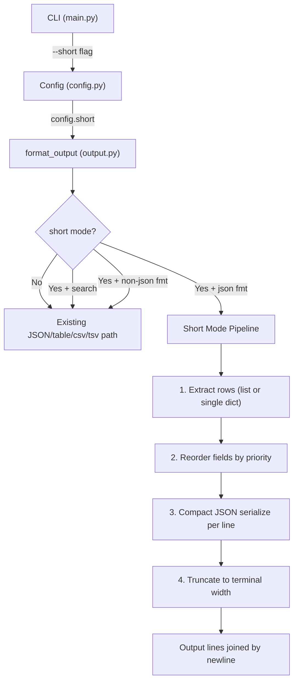

# Design Document: Short Output Mode

## Overview

This feature adds a `--short` / `-s` global boolean flag to r7-cli that activates a compact, single-line-per-object output mode for JSON responses. When active, each JSON object is printed on one line with fields reordered by a three-tier priority heuristic (high → medium → low), and the line is truncated to the terminal width with an ellipsis character to prevent wrapping.

The feature touches four existing modules:

1. `cli_group.py` — register `-s`/`--short` in `GLOBAL_BOOLEAN_FLAGS`
2. `config.py` — add `short: bool` field to `Config`, wire through `resolve_config()`
3. `main.py` — add the Click option and pass it to `resolve_config()`
4. `output.py` — implement short-mode formatting inside `format_output()`

Short mode only applies when the output format is `json`. Other formats (`table`, `csv`, `tsv`) ignore it. The `--search-fields` flag takes precedence over `--short`, and `--limit` is applied before short formatting.

## Architecture



The short-mode pipeline is a pure transformation chain that operates on already-limited data (limit is applied first by the existing `apply_limit` call).

## Components and Interfaces

### 1. CLI Flag Registration

**File:** `cli_group.py`

Add `"-s"` and `"--short"` to `GLOBAL_BOOLEAN_FLAGS`.

**File:** `main.py`

Add `@click.option("-s", "--short", is_flag=True, ...)` to the `cli` group. Pass `short=short` to `resolve_config()`.

### 2. Config Extension

**File:** `config.py`

Add `short: bool` field to the `Config` dataclass. Add `short: bool = False` parameter to `resolve_config()` and pass it through.

### 3. Short Mode Formatting

**File:** `output.py`

Update `format_output()` signature to accept `short: bool = False`. When short mode is active and format is `json` and search is not set:

- `_extract_short_rows(data)` → extracts a list of dicts from the data (handles top-level list, dict-with-nested-list, or single dict)
- `_reorder_fields(obj: dict) -> dict` → reorders keys by priority tier
- `_classify_field(key: str, value: Any) -> int` → returns priority tier (0=high, 1=medium, 2=low, 3=unclassified)
- `_truncate_line(line: str, width: int) -> str` → truncates and appends `…` if needed
- `_format_short(data, terminal_width) -> str` → orchestrates the pipeline

### 4. Field Priority Classification

**Pure function** `_classify_field(key, value)` returns an integer tier:

| Tier | Value | Criteria |
|------|-------|----------|
| High | 0 | `key` is in the `HIGH_PRIORITY_FIELDS` set (exact, case-sensitive) |
| Medium | 1 | `key` contains (case-insensitive) `date`, `time`, `timestamp`, `count`, `version`, `created`; or `value` is a `bool` |
| Low | 2 | `key` contains (case-insensitive) `id`, `uuid`, `token`, `url`, `hash`, `base64`; or `value` matches UUID regex `^[0-9a-f]{8}-[0-9a-f]{4}-[0-9a-f]{4}-[0-9a-f]{4}-[0-9a-f]{12}$` |
| Default | 3 | Everything else — placed between medium and low |

Reorder: tier 0 → tier 1 → tier 3 → tier 2. Within each tier, original insertion order is preserved.

### 5. Terminal Width Detection

Uses `shutil.get_terminal_size().columns`. This is called once per `format_output` invocation, not per line.

## Data Models

### Config Dataclass Change

```python
@dataclass
class Config:
    region: str
    api_key: str
    drp_token: str
    verbose: bool
    debug: bool
    output_format: str
    use_cache: bool
    limit: Optional[int]
    timeout: int
    search: Optional[str]
    short: bool  # NEW — default False
```

### Priority Constants

```python
HIGH_PRIORITY_FIELDS: frozenset[str] = frozenset({
    "name", "title", "status", "type", "severity", "value",
    "description", "hostName", "ip", "domain", "hostname", "mac",
    "product_code", "organization_name", "riskScore", "risk_score",
    "cvss", "cvssScore", "cvss_score",
})

LOW_PRIORITY_SUBSTRINGS: tuple[str, ...] = ("id", "uuid", "token", "url", "hash", "base64")

MEDIUM_PRIORITY_SUBSTRINGS: tuple[str, ...] = ("date", "time", "timestamp", "count", "version", "created")

UUID_PATTERN: re.Pattern = re.compile(
    r"^[0-9a-f]{8}-[0-9a-f]{4}-[0-9a-f]{4}-[0-9a-f]{4}-[0-9a-f]{12}$", re.IGNORECASE
)
```

### format_output Signature Change

```python
def format_output(
    data: Any,
    fmt: str,
    limit: int | None = None,
    search: str | None = None,
    short: bool = False,  # NEW
) -> str:
```


## Correctness Properties

*A property is a characteristic or behavior that should hold true across all valid executions of a system — essentially, a formal statement about what the system should do. Properties serve as the bridge between human-readable specifications and machine-verifiable correctness guarantees.*

### Property 1: Short mode produces one compact JSON line per row

*For any* data input (a list of dicts, a dict containing a nested list, or a single dict with no list fields), calling `format_output` with `short=True` and `fmt="json"` SHALL produce exactly one line of valid compact JSON (no indentation, no extra whitespace) per extracted row, and the number of output lines SHALL equal the number of extracted rows.

**Validates: Requirements 2.1, 2.2, 2.3**

### Property 2: Non-JSON formats ignore short mode

*For any* data input and *for any* non-json format (`table`, `csv`, `tsv`), calling `format_output` with `short=True` SHALL produce identical output to calling `format_output` with `short=False`.

**Validates: Requirements 2.4, 5.3**

### Property 3: Field classification correctness

*For any* field name and value pair, `_classify_field` SHALL return:
- tier 0 (high) if and only if the field name exactly matches a member of `HIGH_PRIORITY_FIELDS`,
- tier 2 (low) if and only if the field name contains one of the low-priority substrings (case-insensitive) or the value matches the UUID pattern,
- tier 1 (medium) if and only if the field name contains one of the medium-priority substrings (case-insensitive) or the value is a boolean,
- tier 3 (default) otherwise.

With the precedence: high > low > medium > default (a field matching both high and low is classified as high; a field matching both low and medium is classified as low).

**Validates: Requirements 3.2, 3.3, 3.4**

### Property 4: Field reordering preserves tier order and within-tier stability

*For any* dict with arbitrary fields, `_reorder_fields` SHALL produce a dict where all high-priority fields appear before all medium-priority fields, which appear before all default-tier fields, which appear before all low-priority fields. Within each tier, the relative order of fields SHALL match their original insertion order in the input dict.

**Validates: Requirements 3.1, 3.5**

### Property 5: Line truncation correctness

*For any* string and positive terminal width, `_truncate_line` SHALL:
- return the string unchanged if its length is ≤ the width,
- return a string of exactly `width` characters ending with `…` if the original string length exceeds the width.

**Validates: Requirements 4.2, 4.3**

### Property 6: Limit is applied before short formatting

*For any* data containing a list of N dicts (N > 0) and *for any* limit L (1 ≤ L ≤ N), calling `format_output` with `short=True` and `limit=L` SHALL produce at most L output lines.

**Validates: Requirements 5.1**

### Property 7: Search takes precedence over short mode

*For any* data and *for any* search field name, calling `format_output` with both `short=True` and `search` set SHALL produce identical output to calling `format_output` with `short=False` and the same `search` value.

**Validates: Requirements 5.2**

## Error Handling

| Scenario | Behavior |
|----------|----------|
| `shutil.get_terminal_size()` returns a very small width (e.g., < 10) | Truncation still applies; output may be just `{…` — this is acceptable since the user chose an extremely narrow terminal |
| Data is `None` or empty list | Short mode produces empty string (no lines), consistent with existing behavior |
| Data contains non-dict items in a list | Items are serialized as compact JSON lines (numbers, strings, etc.) — field reordering is skipped for non-dict items |
| Field value is not JSON-serializable | `json.dumps` with `default=str` fallback, consistent with existing patterns |
| `--short` combined with `--output sql` (if added later) | Short mode only activates for `fmt == "json"`, so any new format is automatically excluded |

No new exception types are needed. The feature is a pure formatting transformation with no I/O beyond `shutil.get_terminal_size()`, which never raises.

## Testing Strategy

### Property-Based Tests (Hypothesis)

The project already has `hypothesis>=6.0` in dev dependencies. Each property from the Correctness Properties section maps to one Hypothesis test with a minimum of 100 examples.

| Test | Property | Generator Strategy |
|------|----------|--------------------|
| `test_short_one_line_per_row` | Property 1 | `st.lists(st.dictionaries(st.text(...), st.one_of(st.text(), st.integers(), st.booleans())))` for lists; wrap in a dict with a random key for nested-list case; single dict with no list values |
| `test_non_json_ignores_short` | Property 2 | Random data + `st.sampled_from(["table", "csv", "tsv"])` |
| `test_classify_field` | Property 3 | `st.text()` for field names, `st.one_of(st.text(), st.integers(), st.booleans())` for values; also targeted generators for high-priority names, low-priority substrings, UUID-pattern strings |
| `test_reorder_preserves_tiers_and_stability` | Property 4 | `st.dictionaries(st.text(), st.one_of(...))` with enough entries to span multiple tiers |
| `test_truncate_line` | Property 5 | `st.text()` for line, `st.integers(min_value=1, max_value=500)` for width |
| `test_limit_before_short` | Property 6 | `st.lists(st.dictionaries(...), min_size=1)` + `st.integers(min_value=1)` for limit |
| `test_search_precedence` | Property 7 | Random nested data + `st.text(min_size=1)` for field name |

Each test is tagged with: `# Feature: short-output, Property N: <title>`

### Unit Tests (pytest)

Focused example-based tests for:
- CLI flag registration: `-s` and `--short` in `GLOBAL_BOOLEAN_FLAGS` (Req 1.4)
- Config wiring: `resolve_config(short=True).short == True`, default is `False` (Req 1.2, 1.3)
- CLI acceptance: invoke CLI with `-s` flag, verify no error (Req 1.1)
- Edge cases: empty list, single dict, `None` data, non-dict list items
- Specific known field names from `HIGH_PRIORITY_FIELDS` to verify exact-match behavior
- Terminal width mock: verify `shutil.get_terminal_size` is called (Req 4.1)

### Test File Location

All tests in a single file: `tests/test_short_output.py` (or alongside existing test files if a `tests/` directory exists).
