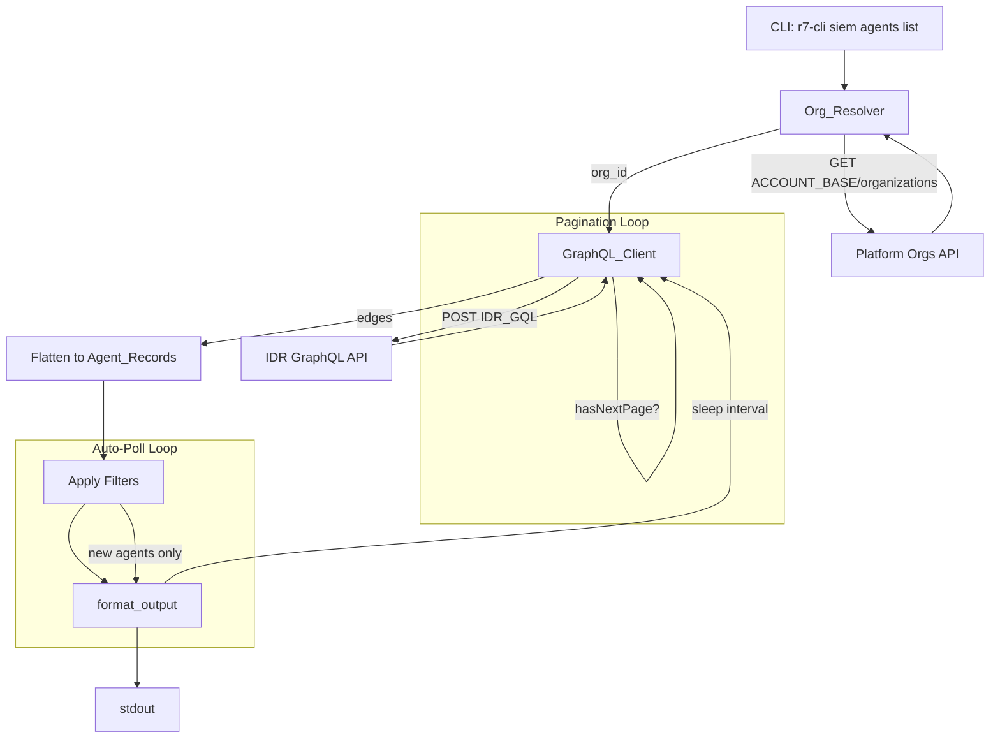

# Design Document: siem-agents-list

## Overview

The `siem agents list` command adds a new subcommand under the existing `siem` Click group that queries the InsightIDR GraphQL API to list agents with host information, NGAV health status, and velociraptor bootstrap state. It follows the established patterns in `siem.py` — using `R7Client` for HTTP, `format_output` for rendering, and cursor-based GQL pagination similar to the existing `quarantine-state` command.

The command flow:
1. Resolve the organization ID by calling the platform orgs API and matching on the configured region
2. Build and send a GraphQL query to `IDR_GQL` with the org ID and page size
3. Flatten the nested GQL response into `Agent_Record` dicts
4. Apply optional filters (`--ngav-status`, `--velociraptor-status`)
5. Output via `format_output()` respecting global flags

## Architecture



All components live in `solutions/siem.py`, consistent with the existing command structure. No new files are needed — the GQL query string goes in `models.py` alongside `GQL_QUARANTINE_STATE`.

## Components and Interfaces

### 1. `agents` Click Group

A new `@siem.group("agents")` registered under the existing `siem` group, following the same pattern as `accounts`, `investigations`, etc.

### 2. `list` Command

```python
@agents.command("list")
@click.option("-l", "--limit", type=int, default=10, help="Agents per page (default: 10).")
@click.option("--all-pages", is_flag=True, help="Fetch all pages via cursor pagination.")
@click.option("-a", "--auto", "auto_poll", is_flag=True, help="Poll for new agents.")
@click.option("-i", "--interval", type=int, default=30, help="Polling interval in seconds (default: 30).")
@click.option("--ngav-status", default=None, help="Filter by NGAV health: GOOD, POOR, N/A, Not Monitored.")
@click.option("--velociraptor-status", default=None,
              type=click.Choice(["RUNNING", "NOT_RUNNING"], case_sensitive=True),
              help="Filter by velociraptor state.")
@click.pass_context
def agents_list(ctx, limit, all_pages, auto_poll, interval, ngav_status, velociraptor_status):
```

### 3. `_resolve_org_id(client, config) -> str`

Helper function that:
- Calls `GET ACCOUNT_BASE.format(region=config.region) + "/organizations"`
- Iterates the response list, normalizing each org's `region` via `REGION_ALIASES`
- Returns the `id` of the first match
- Raises `UserInputError` if no match found

### 4. `_build_agents_query(limit, cursor, include_bootstrap) -> dict`

Builds the GraphQL query payload dict with:
- `query`: the GQL string with `$orgId`, `$first`, `$cursor` variables
- `variables`: `{"orgId": org_id, "first": limit, "cursor": cursor_or_null}`

The `bootstrap` field is always included in the query for simplicity (avoids two query variants). The velociraptor filter is applied client-side after fetching.

### 5. `_flatten_agent_node(node) -> dict`

Converts a nested GQL node into a flat `Agent_Record` dict:

```python
{
    "agent_id": node["agent"]["id"],
    "agent_status": node["agent"]["agentStatus"],
    "agent_mode": node["agent"]["agentMode"],
    "beacon_time": node["agent"]["beaconTime"],
    "agent_last_update": node["agent"]["agentLastUpdateTime"],
    "host_names": ", ".join(h["name"] for h in node["host"]["hostNames"]),
    "host_vendor": node["host"]["vendor"],
    "host_version": node["host"]["version"],
    "host_type": node["host"]["type"],
    "primary_ip": node["host"]["primaryAddress"]["ip"],
    "primary_mac": node["host"]["primaryAddress"]["mac"],
    "alternate_addresses": node["host"]["alternateAddresses"],
    "public_ip": node["publicIpAddress"],
    "sys_arch": node["sysArch"],
    "ngav_group_id": node["endpointPrevention"]["group"]["id"],
    "ngav_group_name": node["endpointPrevention"]["group"]["name"],
    "ngav_status": node["endpointPrevention"]["status"]["health"],
    "velociraptor_state": <extracted from bootstrap.components where name=="velociraptor">,
    "velociraptor_version": <extracted from bootstrap.components where name=="velociraptor">,
}
```

Fields that may be `None` in the GQL response are handled with safe `.get()` chains.

### 6. `_apply_agent_filters(records, ngav_status, velociraptor_status) -> list[dict]`

Filters the flat `Agent_Record` list:
- If `ngav_status` is set: keep only records where `ngav_status == ngav_status` (case-sensitive)
- If `velociraptor_status` is `RUNNING`: keep only records where `velociraptor_state == "RUNNING"`
- If `velociraptor_status` is `NOT_RUNNING`: keep records where `velociraptor_state != "RUNNING"` (including `None`)

### 7. GQL Query String (`GQL_AGENTS_LIST` in `models.py`)

```graphql
query AgentsList($orgId: String!, $first: Int!, $cursor: String) {
  organization(id: $orgId) {
    assets(first: $first, after: $cursor) {
      pageInfo { endCursor hasNextPage }
      edges {
        node {
          agent {
            id agentStatus agentMode beaconTime agentLastUpdateTime
          }
          endpointPrevention {
            group { id name }
            status { health }
          }
          bootstrap {
            components { name lastStartTime state version }
          }
          host {
            hostNames { name }
            vendor version type
            primaryAddress { ip mac }
            alternateAddresses { ip mac }
          }
          publicIpAddress
          sysArch
        }
        cursor
      }
    }
  }
}
```

## Data Models

### Agent_Record (flat dict)

| Field | Type | Source |
|---|---|---|
| `agent_id` | `str` | `agent.id` |
| `agent_status` | `str` | `agent.agentStatus` |
| `agent_mode` | `str` | `agent.agentMode` |
| `beacon_time` | `str` | `agent.beaconTime` |
| `agent_last_update` | `str` | `agent.agentLastUpdateTime` |
| `host_names` | `str` | `host.hostNames[].name` joined by `, ` |
| `host_vendor` | `str\|None` | `host.vendor` |
| `host_version` | `str\|None` | `host.version` |
| `host_type` | `str\|None` | `host.type` |
| `primary_ip` | `str\|None` | `host.primaryAddress.ip` |
| `primary_mac` | `str\|None` | `host.primaryAddress.mac` |
| `alternate_addresses` | `list[dict]` | `host.alternateAddresses` |
| `public_ip` | `str\|None` | `publicIpAddress` |
| `sys_arch` | `str\|None` | `sysArch` |
| `ngav_group_id` | `str\|None` | `endpointPrevention.group.id` |
| `ngav_group_name` | `str\|None` | `endpointPrevention.group.name` |
| `ngav_status` | `str\|None` | `endpointPrevention.status.health` |
| `velociraptor_state` | `str\|None` | `bootstrap.components[name=="velociraptor"].state` |
| `velociraptor_version` | `str\|None` | `bootstrap.components[name=="velociraptor"].version` |

### GraphQL Response Shape

```json
{
  "data": {
    "organization": {
      "assets": {
        "pageInfo": { "endCursor": "abc123", "hasNextPage": true },
        "edges": [
          {
            "node": { ... },
            "cursor": "abc123"
          }
        ]
      }
    }
  }
}
```

### Platform Orgs Response Shape

```json
[
  {
    "id": "org-uuid",
    "name": "My Org",
    "region": "us1",
    ...
  }
]
```


## Correctness Properties

*A property is a characteristic or behavior that should hold true across all valid executions of a system — essentially, a formal statement about what the system should do. Properties serve as the bridge between human-readable specifications and machine-verifiable correctness guarantees.*

### Property 1: Org resolution matches correct organization with region normalization

*For any* list of organizations with distinct regions and *for any* target region (including aliases like `us1`→`us`), the org resolver SHALL return the `id` of the organization whose normalized region matches the normalized target region.

**Validates: Requirements 1.2, 1.3**

### Property 2: Org resolution raises error when no organization matches

*For any* list of organizations where no organization's normalized region matches the target region, the org resolver SHALL raise a `UserInputError`.

**Validates: Requirements 1.4**

### Property 3: Cursor pagination accumulates all edges across pages

*For any* sequence of GraphQL page responses where each page has `pageInfo.hasNextPage` and `pageInfo.endCursor`, the paginator SHALL accumulate edges from every page into a single list whose length equals the sum of edges across all pages, and each subsequent request SHALL use the previous page's `endCursor` as the `after` variable.

**Validates: Requirements 3.1, 3.2, 3.3**

### Property 4: Agent node flattening preserves all source data

*For any* valid GraphQL agent node, flattening it into an `Agent_Record` dict SHALL produce a dict containing all expected keys, and each value SHALL equal the corresponding value extracted from the nested source path (e.g., `agent_id` equals `node.agent.id`, `ngav_status` equals `node.endpointPrevention.status.health`).

**Validates: Requirements 2.3, 8.1**

### Property 5: NGAV status filter retains only matching agents

*For any* list of `Agent_Record` dicts and *for any* NGAV status value, filtering by that value SHALL produce a list where every record's `ngav_status` field equals the filter value, and no records with a different `ngav_status` are included.

**Validates: Requirements 6.2**

### Property 6: Velociraptor status filter correctly partitions agents

*For any* list of `Agent_Record` dicts, filtering by `RUNNING` SHALL retain only records where `velociraptor_state == "RUNNING"`, and filtering by `NOT_RUNNING` SHALL retain only records where `velociraptor_state != "RUNNING"` (including `None`). The union of both filtered sets SHALL equal the original list, and their intersection SHALL be empty.

**Validates: Requirements 7.2, 7.3**

### Property 7: Auto-poll deduplication emits only new agents

*For any* sequence of poll result sets (each a list of agent IDs), the deduplication logic SHALL emit an agent ID only on the first poll where it appears, and never again on subsequent polls.

**Validates: Requirements 5.3**

### Property 8: GraphQL error response extraction

*For any* GraphQL response containing a non-empty `errors` array, the command SHALL raise an `APIError` whose message equals the `message` field of the first element in the `errors` array.

**Validates: Requirements 2.4, 9.3**

## Error Handling

| Scenario | Exception | Exit Code | Message |
|---|---|---|---|
| No org matches configured region | `UserInputError` | 1 | `No organization found for region '{region}'` |
| Network timeout or connection failure | `NetworkError` (from `R7Client`) | 3 | Timeout/connection error details |
| HTTP 401 from orgs API or GQL API | `APIError` (from `R7Client`) | 2 | Invalid/missing API key message |
| GQL response contains `errors` array | `APIError` | 2 | First error message from the array |
| Other HTTP errors (4xx/5xx) | `APIError` (from `R7Client`) | 2 | Extracted error message or raw status |
| Any `R7Error` subclass | Caught in top-level handler | Varies | `str(exc)` printed to stderr |

The command wraps its body in `try/except R7Error` and `except KeyboardInterrupt`, matching the pattern used by `quarantine_state`, `investigations_list`, and other existing commands.

GQL error checking happens before flattening: if `response.get("errors")` is truthy, raise `APIError` immediately with the first error's message.

## Testing Strategy

### Unit Tests (example-based)

- Org resolver returns correct ID for a known org list (happy path)
- Org resolver applies `us1`→`us` normalization
- Org resolver raises `UserInputError` when no match
- GQL query string contains all required fields (`agent`, `host`, `endpointPrevention`, `bootstrap`, `publicIpAddress`, `sysArch`)
- Limit value is correctly placed in query variables
- Single-page fetch (no `--all-pages`) returns only first page
- Empty result set produces empty list
- `KeyboardInterrupt` during auto-poll prints "Stopped polling." to stderr
- GQL error response raises `APIError` with first error message
- Click command registration: `agents` group under `siem`, `list` under `agents`
- `--help` output contains all expected options

### Property Tests (property-based, using Hypothesis)

Each property test runs a minimum of 100 iterations.

- **Feature: siem-agents-list, Property 1**: Org resolution matching — generate random org lists and target regions, verify correct match
- **Feature: siem-agents-list, Property 2**: Org resolution error — generate org lists with no matching region, verify `UserInputError`
- **Feature: siem-agents-list, Property 3**: Cursor pagination accumulation — generate multi-page response sequences, verify all edges accumulated with correct cursor threading
- **Feature: siem-agents-list, Property 4**: Node flattening — generate random valid GQL nodes, verify flat dict keys and values match source paths
- **Feature: siem-agents-list, Property 5**: NGAV filter — generate random agent record lists and filter values, verify only matching records retained
- **Feature: siem-agents-list, Property 6**: Velociraptor filter partitioning — generate random agent records, verify RUNNING/NOT_RUNNING partition is correct and complete
- **Feature: siem-agents-list, Property 7**: Auto-poll deduplication — generate sequences of agent ID sets, verify each ID emitted exactly once
- **Feature: siem-agents-list, Property 8**: GQL error extraction — generate random error arrays, verify first message used

### Testing Library

Use **Hypothesis** for property-based testing (already a standard Python PBT library). Configure `@settings(max_examples=100)` minimum per property.

### Integration Tests

- End-to-end Click runner test with mocked `R7Client` verifying the full command flow from CLI invocation through output
- Verify `--all-pages` makes multiple requests with correct cursor values against a mock
- Verify `--auto` polling loop with mocked sleep and client


## Post-Implementation Changes

- Command available as `r7-cli siem agents list` (also `r7-cli platform assets list` via `agents.py` for cross-solution view)
- GQL query simplified: removed host, endpointPrevention, bootstrap fields; now uses agent (id, agentStatus, agentSemanticVersion, deployTime, agentLastUpdateTime), publicIpAddress, platform
- `--ngav-status` and `--velociraptor-status` filters removed
- `-l/--limit` renamed to `--size` to avoid conflict with global `-l`
- `siem agents count` subcommand added for total SIEM agent count
- `platform assets count` subcommand added with `--vm`, `--siem`, `--asm`, `--appsec`, `--drp` options
- Org ID resolution via `_resolve_org_id` helper
