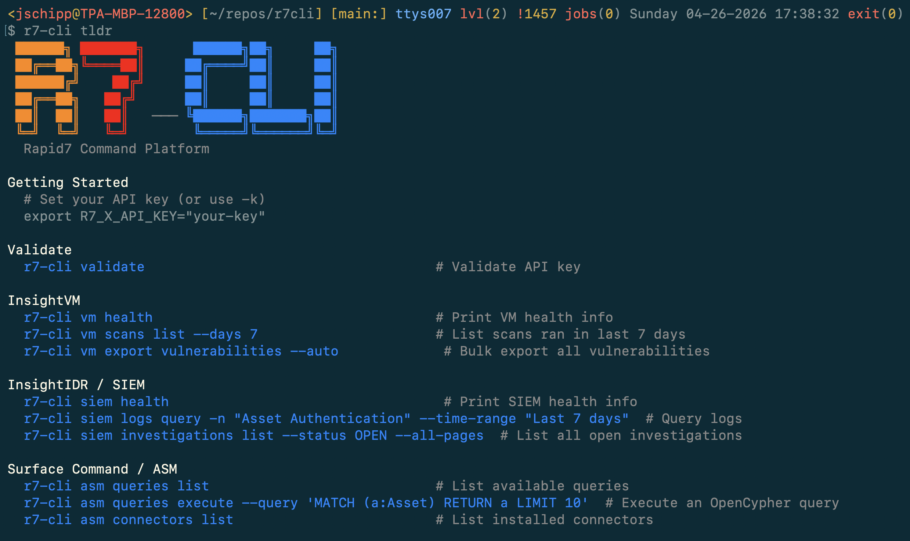

# r7-cli

The Rapid7 Command Platform at your finger tips. Easily query, update, and manage Rapid7 solutions in a single tool.




```bash
$ r7-cli platform matrix
Display the licensed Rapid7 products that you're authorized for, not authorized for, and the ones that are not applicable.
+---------------+----------+------------+-----------+----------+-----------+-----------+
|               | GOVERN   | IDENTIFY   | PROTECT   | DETECT   | RESPOND   | RECOVER   |
+===============+==========+============+===========+==========+===========+===========+
| DEVICES       | 🚫       | ✅         | ✅        | ✅       | ✅        | N/A       |
+---------------+----------+------------+-----------+----------+-----------+-----------+
| SOFTWARE      | 🚫       | ✅         | ✅        | ✅       | ✅        | N/A       |
+---------------+----------+------------+-----------+----------+-----------+-----------+
| NETWORK       | 🚫       | ✅         | ✅        | ✅       | ✅        | N/A       |
+---------------+----------+------------+-----------+----------+-----------+-----------+
| USERS         | 🚫       | ✅         | ✅        | ✅       | ✅        | N/A       |
+---------------+----------+------------+-----------+----------+-----------+-----------+
| DATA          | 🚫       | 🚫         | ✅        | ✅       | ✅        | N/A       |
+---------------+----------+------------+-----------+----------+-----------+-----------+
| DOCUMENTATION | 🚫       | N/A        | 🚫        | 🚫       | ✅        | N/A       |
+---------------+----------+------------+-----------+----------+-----------+-----------+

Recommended products to improve your coverage:
  + Cyber GRC             (+8 cells)
  + DSPM                  (+1 cells)
```

> Full API reference, command tables, and detailed usage: [docs/REFERENCE.md](docs/REFERENCE.md)

## Quick Start

```bash
git clone <repo-url> r7cli && cd r7cli
python3 -m venv .venv && source .venv/bin/activate
pip install -e .
export R7_X_API_KEY="your-api-key"
r7-cli --help
```

## Requirements

- Python 3.10+
- Dependencies: `click`, `httpx`, `tabulate`, `pyarrow`, `questionary`

## Solutions

| Command | Product | Auth |
|---------|---------|------|
| `r7-cli vm` | InsightVM | Platform API key |
| `r7-cli siem` | InsightIDR | Platform API key |
| `r7-cli asm` | Surface Command | Platform API key |
| `r7-cli drp` | Digital Risk Protection | DRP token |
| `r7-cli appsec` | InsightAppSec | Platform API key |
| `r7-cli cnapp` | InsightCloudSec | InsightCloudSec API key |
| `r7-cli soar` | InsightConnect | Platform API key |
| `r7-cli platform` | Platform admin | Platform API key |

## Common Usage

```bash
# Validate credentials
r7-cli validate

# VM scans and assets
r7-cli vm scans list --days 7
r7-cli vm assets list --hostname 'webserver' --all-pages
r7-cli vm export vulnerabilities --auto

# SIEM investigations
r7-cli siem health
r7-cli siem investigations list --status OPEN

# Surface Command queries
r7-cli asm queries execute --query 'MATCH (a:Asset) RETURN a LIMIT 10'

# DRP alerts
r7-cli drp alerts list --severity High --days 30

# Platform admin
r7-cli platform products list
r7-cli platform users list
r7-cli platform status

# Coverage matrix
r7-cli platform matrix
r7-cli platform matrix --percent
r7-cli platform matrix --json
```

## Global Options

| Flag | Description |
|------|-------------|
| `-r, --region` | Region code (default: `us`) |
| `-k, --api-key` | API key (overrides env var) |
| `-o, --output` | Format: `json`, `table`, `csv`, `tsv`, `sql` |
| `-s, --short` | Compact single-line output |
| `-l, --limit` | Limit result count |
| `-c, --cache` | Use cached responses |
| `-v, --verbose` | Log requests to stderr |
| `--debug` | Log full request/response bodies |
| `-t, --timeout` | Request timeout in seconds (default: 30) |
| `--search-fields` | Search response for a field name |
| `--drp-token` | DRP API token in `user:key` format |
| `--tldr` | Show quick-reference examples |

## Output Formats

```bash
r7-cli -o table platform products list   # table
r7-cli -o csv vm scan-engines list            # CSV
r7-cli -s platform products list         # compact JSON
r7-cli -l 5 vm scans list               # limit to 5
```

## Interactive & Polling

```bash
r7-cli vm scans get --auto               # interactive picker
r7-cli vm scans list -a -i 30            # poll every 30s
```

## Parquet Exports (Offline)

```bash
r7-cli vm export vulnerabilities --auto
r7-cli vm export list --severity Critical --has-exploits true
r7-cli vm export list --hostname '*.prod.*' --where 'cvssScore>=9.0'
```

## Development

```bash
pip install -e ".[dev]"
pytest
```

## Error Codes

| Exit Code | Meaning |
|-----------|---------|
| 1 | User input error |
| 2 | API error (4xx/5xx) |
| 3 | Network error |

## License

See LICENSE file.
