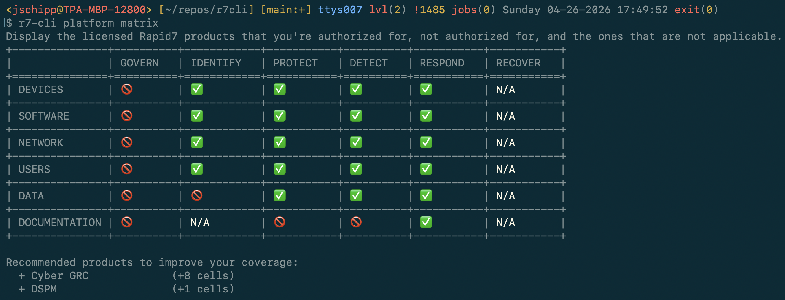

# r7-cli

The Rapid7 Command Platform at your finger tips. Easily query, update, and manage Rapid7 solutions in a single tool.


Example



## Features

* Queries: Query and download SIEM & ASM logs to analyze locally or export to other systems
* Compliance: Download raw Rapid7 data for compliance evidence for internal & external audits
* Automation: Use in scripts for data enrichment and to check product health and platform status
* Manage: Manage and provision many Rapid7 product settings in a repeatable way
* APIs: Simplify learning and usage of Rapid7's APIs

> Full API reference, command tables, and detailed usage: [docs/REFERENCE.md](docs/REFERENCE.md)

## Quick Start

```bash
git clone <repo-url> r7cli && cd r7cli
python3 -m venv .venv && source .venv/bin/activate
pip install -e .
export R7_X_API_KEY="your-api-key"
r7-cli --help
```

## Requirements

- Python 3.10+
- Dependencies: `click`, `httpx`, `tabulate`, `pyarrow`, `questionary`

## Solutions

| Command | Product | Auth |
|---------|---------|------|
| `r7-cli vm` | InsightVM | Platform API key |
| `r7-cli siem` | InsightIDR | Platform API key |
| `r7-cli asm` | Surface Command | Platform API key |
| `r7-cli drp` | Digital Risk Protection | DRP token |
| `r7-cli appsec` | InsightAppSec | Platform API key |
| `r7-cli cnapp` | InsightCloudSec | InsightCloudSec API key |
| `r7-cli soar` | InsightConnect | Platform API key |
| `r7-cli platform` | Platform admin | Platform API key |

## Common Usage

```bash
# Validate credentials
r7-cli validate

# Natural language commands (requires LLM provider)
r7-cli --llm openai ai show me critical vulnerabilities
r7-cli --llm claude ai -x list all open investigations

# VM scans and assets
r7-cli vm scans list --days 7
r7-cli vm assets list --hostname 'webserver' --all-pages
r7-cli vm export vulnerabilities --auto

# MCP server (AI-powered bulk export analysis)
r7-cli vm export mcp install
r7-cli vm export mcp start-export
r7-cli vm export mcp query "SELECT severity, COUNT(*) FROM vulnerabilities GROUP BY severity"

# SIEM investigations
r7-cli siem health
r7-cli siem investigations list --status OPEN

# Surface Command queries
r7-cli asm queries execute --query 'MATCH (a:Asset) RETURN a LIMIT 10'

# DRP alerts
r7-cli drp alerts list --severity High --days 30

# Platform admin
r7-cli platform products list
r7-cli platform users list
r7-cli platform status

# Coverage matrix
r7-cli platform matrix
r7-cli platform matrix --percent
r7-cli platform matrix --json
```

## Global Options

| Flag | Description |
|------|-------------|
| `-r, --region` | Region code (default: `us`) |
| `-k, --api-key` | API key (overrides env var) |
| `-o, --output` | Format: `json`, `table`, `csv`, `tsv`, `sql` |
| `-s, --short` | Compact single-line output |
| `-l, --limit` | Limit result count |
| `-c, --cache` | Use cached responses |
| `-v, --verbose` | Log requests to stderr |
| `--debug` | Log full request/response bodies |
| `-t, --timeout` | Request timeout in seconds (default: 30) |
| `--search-fields` | Search response for a field name |
| `--drp-token` | DRP API token in `user:key` format |
| `--llm` | LLM provider for natural language commands (`openai`, `claude`, `gemini`) |
| `--llm-key` | API key for the LLM provider |
| `--tldr` | Show quick-reference examples |

## Output Formats

```bash
r7-cli -o table platform products list   # table
r7-cli -o csv vm scan-engines list            # CSV
r7-cli -s platform products list         # compact JSON
r7-cli -l 5 vm scans list               # limit to 5
```

## Interactive & Polling

```bash
r7-cli vm scans get --auto               # interactive picker
r7-cli vm scans list -a -i 30            # poll every 30s
```

## Parquet Exports (Offline)

```bash
r7-cli vm export vulnerabilities --auto
r7-cli vm export list --severity Critical --has-exploits true
r7-cli vm export list --hostname '*.prod.*' --where 'cvssScore>=9.0'
```

## MCP Server Integration

The [Rapid7 Bulk Export MCP](https://github.com/rapid7/rapid7-bulk-export-mcp) server provides AI-powered analysis of bulk export data using a local DuckDB database.

```bash
# Install the MCP server
r7-cli vm export mcp install

# Configure for your AI tool (Kiro, Claude Desktop, VS Code, etc.)
r7-cli vm export mcp configure
r7-cli vm export mcp configure --target claude-desktop

# Export and load data
r7-cli vm export mcp start-export
r7-cli vm export mcp status --id <EXPORT_ID>
r7-cli vm export mcp download --id <EXPORT_ID>

# Query with SQL
r7-cli vm export mcp query "SELECT severity, COUNT(*) FROM vulnerabilities GROUP BY severity"
r7-cli vm export mcp schema
r7-cli vm export mcp stats
```

## Natural Language Commands

Use `r7-cli ai` to describe what you want in plain English. An LLM translates your request into the correct CLI command.

```bash
# Configure LLM provider (or set R7_LLM_PROVIDER + provider API key env vars)
r7-cli --llm openai ai show me critical vulnerabilities
r7-cli --llm claude ai how many assets do I have
r7-cli --llm gemini ai list scans from the last week

# Execute the generated command directly
r7-cli --llm openai ai -x list all open investigations

# Skip confirmation prompt
r7-cli --llm claude ai -x -y check VM health
```

Environment variables: `R7_LLM_PROVIDER`, `OPENAI_API_KEY`, `ANTHROPIC_API_KEY`, `GEMINI_API_KEY`

## Development

```bash
pip install -e ".[dev]"
pytest
```

## Error Codes

| Exit Code | Meaning |
|-----------|---------|
| 1 | User input error |
| 2 | API error (4xx/5xx) |
| 3 | Network error |

## License

See LICENSE file.
